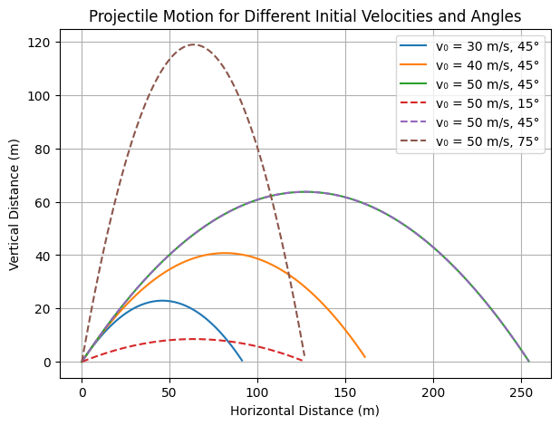

# Problem 1

# **Mechanics Problem 1: Investigating the Range as a Function of the Angle of Projection**

## **1. Introduction and Motivation**
Projectile motion is one of the most fundamental topics in mechanics, with applications in sports, ballistics, space exploration, and engineering. Understanding how the **range of a projectile** varies with its **launch angle** is crucial in many real-world scenarios:

- **Sports Science**: Optimizing a soccer player's free-kick or a basketball shot.
- **Military and Ballistics**: Calculating the range of a projectile in different terrains.
- **Space Science**: Predicting the trajectory of spacecraft launched from different planets.
- **Engineering**: Designing water fountains or roller coasters with precise parabolic arcs.

In this study, we investigate how the range of a projectile depends on the launch angle and explore factors that influence projectile motion.

---

## **2. Theoretical Foundation**

### **Newton’s Second Law**
Newton’s second law states that the force acting on an object is equal to the product of its mass and acceleration:

$$
\vec{F} = m \vec{a}
$$

For a projectile in free fall under Earth's gravitational field, the only force acting on it is gravity:

$$
\vec{F} = -mg \hat{j}
$$

Since acceleration is the second derivative of position with respect to time, Newton’s second law can be written as:

$$
m \frac{d^2 \vec{r}}{dt^2} = -mg \hat{j}
$$

Dividing by mass:

$$
\frac{d^2 \vec{r}}{dt^2} = -g \hat{j}
$$

This equation shows that the object experiences **constant downward acceleration** due to gravity while moving freely in space.

---

## **3. Equations of Motion**
Projectile motion consists of **two independent components**:  

- **Horizontal Motion ($x$-direction)**:
  - No force acts in the horizontal direction, so acceleration is zero.

    $$
    \frac{d^2 x}{dt^2} = 0
    $$

  - The horizontal velocity remains constant:

    $$
    v_x = v_0 \cos\theta
    $$

  - The horizontal position as a function of time:

    $$ 
    x(t) = v_0 \cos\theta \cdot t
    $$

- **Vertical Motion ($y$-direction)**:
  - Gravity is the only force acting, so acceleration is:

    $$
    \frac{d^2 y}{dt^2} = -g
    $$

  - The vertical velocity changes over time:

    $$
    v_y = v_0 \sin\theta - gt
    $$

  - The vertical position equation:

    $$ 
    y(t) = h + v_0 \sin\theta \cdot t - \frac{1}{2} g t^2
    $$

---

## **4. Time of Flight**
The total time the projectile spends in the air is obtained by solving for $T$ when the projectile lands ($y(T) = 0$):

$$
h + v_0 \sin\theta \cdot T - \frac{1}{2} g T^2 = 0
$$

Solving for $T$ using the quadratic formula:

$$
T = \frac{v_0 \sin\theta + \sqrt{(v_0 \sin\theta)^2 + 2gh}}{g}
$$

This equation gives the **total duration** the projectile remains airborne.

---

## **5. Range Equation**
The range ($R$) is the total horizontal distance traveled:

$$
R = v_0 \cos\theta \cdot T
$$

Substituting $T$:

$$
R = \frac{v_0 \cos\theta (v_0 \sin\theta + \sqrt{(v_0 \sin\theta)^2 + 2gh})}{g}
$$

For **flat ground** ($h = 0$), the well-known formula simplifies to:

$$
R = \frac{v_0^2 \sin(2\theta)}{g}
$$

This equation tells us that **the maximum range occurs at $\theta = 45^\circ$**, assuming no air resistance.

## Python Visualization:

Collab Visualization: https://colab.research.google.com/drive/1OJ9PvOWkqUUzbr23i4xrCo_lYyVzG-4J

# **Projectile Range vs. Launch Angle**

## **Introduction**
The plot represents the relationship between the **range of a projectile** and its **launch angle** in a uniform gravitational field, assuming **no air resistance**. It shows how the horizontal displacement of a projectile changes with different launch angles.

## **Understanding the Axes**
- **X-axis (`Launch Angle (degrees)`)**: Represents the angle at which the projectile is launched, ranging from `0°` to `90°`.
- **Y-axis (`Range (meters)`)**: Represents the horizontal distance (range) the projectile travels before hitting the ground.

## **Key Observations from the Graph**
1. The **curve is symmetric** about `45°`, meaning that launching a projectile at an angle `θ` gives the same range as launching at `90° - θ`. For example, `30°` and `60°` provide the same range.
2. The **maximum range** occurs at `45°`, which is highlighted by the red dashed vertical line.
3. As the launch angle increases from `0°` to `45°`, the range **increases**.
4. Beyond `45°`, the range **decreases**, reaching `0` again at `90°`.

## **Physics Behind the Graph**
The range `R` of a projectile launched with initial velocity `v₀` at angle `θ` is given by:

$
R = \frac{v₀^2 \sin(2θ)}{g}
$

where:
- `v₀` is the initial velocity,
- `g` is the acceleration due to gravity (`9.81 m/s²` on Earth),
- `θ` is the launch angle.

### **Why is Maximum Range at 45°?**
- The range formula contains `sin(2θ)`, which reaches its maximum when `2θ = 90°`, i.e., `θ = 45°`.
- At `45°`, the horizontal and vertical components of velocity are **equal**, maximizing the distance covered before the projectile lands.

## **Legend Explanation**
- **Blue Curve**: "Range vs Angle" - This shows how the range varies with launch angle.
- **Red Dashed Line at `45°`**: "Max Range at 45°" - Highlights the optimal angle for achieving the longest range.

## **Conclusion**
This plot illustrates the fundamental principle of projectile motion: **the launch angle of 45° provides the maximum range** in an idealized environment. The symmetry of the curve reflects the trade-off between vertical and horizontal components of velocity as the angle changes.

Collab Visualization: https://colab.research.google.com/drive/1pjSAtyFPm4nVpRGA02_JjOp854q0Tnnk

# **Projectile Motion for Different Initial Velocities and Angles**

## **Introduction**
This graph illustrates the **trajectory of projectiles** launched at different **initial velocities** (`v₀`) and **launch angles** (`θ`). The trajectories follow **parabolic paths**, which is a fundamental characteristic of motion under uniform gravitational acceleration.

## **Understanding the Axes**
- **X-axis (`Horizontal Distance (m)`)**: Represents the horizontal displacement of the projectile.
- **Y-axis (`Vertical Distance (m)`)**: Represents the height of the projectile at different points in its trajectory.

## **Legend Explanation**
The legend on the right specifies different launch conditions:
- **Solid Lines** represent projectiles launched at `θ = 45°` with different initial velocities (`30 m/s`, `40 m/s`, `50 m/s`).
- **Dashed Lines** indicate projectiles launched at different angles (`15°` and `75°`) but with the same initial velocity (`50 m/s`).

Each curve represents the path taken by a projectile under a given launch condition.

## **Key Observations**
1. **Effect of Increasing Initial Velocity (`v₀`) at `45°`**:
   - The **blue, orange, and green curves** correspond to increasing values of `v₀ = 30, 40, 50 m/s`, respectively.
   - As `v₀` increases, both **maximum height** and **range** increase.
   - The projectile with `v₀ = 50 m/s` (green) covers the greatest horizontal distance.

2. **Effect of Different Launch Angles at `v₀ = 50 m/s`**:
   - The **red dashed curve (`15°`)** has a lower trajectory and a **shorter range** due to its low vertical component.
   - The **brown dashed curve (`75°`)** has a much higher peak but a **shorter horizontal range**, as more energy is directed into vertical motion.
   - The **green solid curve (`45°`)** has the **maximum range**, confirming that `45°` is the optimal angle for distance in ideal projectile motion.

## **Physics Behind the Graph**
The motion follows the kinematic equations:

### **Equations of Motion**
1. **Horizontal Position:**
   $
   x = v_0 \cos(\theta) t
   $
   - Determines how far the projectile moves in the horizontal direction.
   - The horizontal velocity remains constant (assuming no air resistance).

2. **Vertical Position:**
   $
   y = v_0 \sin(\theta) t - \frac{1}{2} g t^2
   $
   - The projectile first rises, slows down due to gravity, and then falls back to the ground.

3. **Time of Flight:**
   $
   T = \frac{2 v_0 \sin(\theta)}{g}
   $
   - Higher launch angles result in longer flight times.

4. **Range:**
   $
   R = \frac{v_0^2 \sin(2\theta)}{g}
   $
   - `R` is maximized at `θ = 45°` in the absence of air resistance.

5. **Maximum Height:**
   $
   H = \frac{(v_0 \sin(\theta))^2}{2g}
   $
   - Larger `θ` results in a higher peak.

## **Conclusion**
- The **optimal launch angle for maximum range is `45°`**.
- Increasing **initial velocity (`v₀`)** increases both range and height.
- **Lower angles (`15°`)** result in a flatter trajectory with less height.
- **Higher angles (`75°`)** yield greater height but shorter range.
- The **trajectories are parabolic**, as expected for projectile motion under uniform gravity.

This plot effectively demonstrates the effect of velocity and angle on projectile motion.
