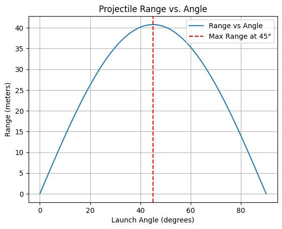

# Problem 1

# **Mechanics Problem 1: Investigating the Range as a Function of the Angle of Projection**

## **1. Theoretical Foundation**

### **Newton’s Second Law**
Newton’s second law states:

$$
\vec{F} = m \vec{a}
$$

For a projectile in free fall under gravity:

$$
\vec{F} = -mg \hat{j}
$$

Since acceleration is the second derivative of position:

$$
m \frac{d^2 \vec{r}}{dt^2} = -mg \hat{j}
$$

Dividing by mass:

$$
\frac{d^2 \vec{r}}{dt^2} = -g \hat{j}
$$

This gives two independent equations:

- **Horizontal Motion ($x$-direction):**
  
  $$
  \frac{d^2 x}{dt^2} = 0 \quad \Rightarrow \quad v_x = v_0 \cos\theta
  $$

  $$ 
  x(t) = v_0 \cos\theta \cdot t
  $$

- **Vertical Motion ($y$-direction):**
  
  $$
  \frac{d^2 y}{dt^2} = -g
  $$

  Integrating:

  $$
  v_y = v_0 \sin\theta - gt
  $$

  $$ 
  y(t) = h + v_0 \sin\theta \cdot t - \frac{1}{2} g t^2
  $$

### **Time of Flight**
Solving $y(T) = 0$:

$$
h + v_0 \sin\theta \cdot T - \frac{1}{2} g T^2 = 0
$$

Solving for $T$:

$$
T = \frac{v_0 \sin\theta + \sqrt{(v_0 \sin\theta)^2 + 2gh}}{g}
$$

### **Range Equation**
The range is:

$$
R = v_0 \cos\theta \cdot T
$$

Substituting $T$:

$$
R = \frac{v_0 \cos\theta (v_0 \sin\theta + \sqrt{(v_0 \sin\theta)^2 + 2gh})}{g}
$$

For $h = 0$:

$$
R = \frac{v_0^2 \sin(2\theta)}{g}
$$

## Python Visualization:

