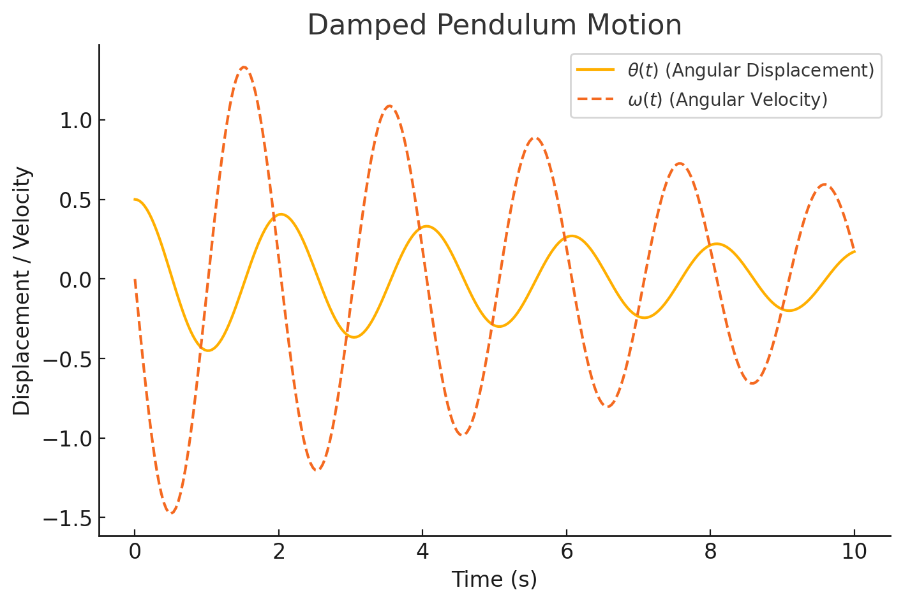

# Problem 2

# Dynamics of a Damped Pendulum

A **damped pendulum** is a simple pendulum that experiences resistive forces, such as air resistance or friction at the pivot. The equation of motion for a damped pendulum is:

$$
\frac{d^2\theta}{dt^2} + \frac{b}{m} \frac{d\theta}{dt} + \frac{g}{L} \sin\theta = 0
$$

where:  
- $\theta$ is the angular displacement,  
- $b$ is the damping coefficient,  
- $m$ is the mass of the pendulum,  
- $g$ is the gravitational acceleration ($9.81 \, m/s^2$),  
- $L$ is the length of the pendulum.  

## Types of Damping
1. **Underdamped ($b/m$ is small):** The pendulum oscillates but with decreasing amplitude.  
2. **Critically damped ($b/m$ is optimal):** The pendulum returns to equilibrium without oscillating.  
3. **Overdamped ($b/m$ is large):** The pendulum slowly returns to equilibrium without oscillating.  

## Python Visualization:

