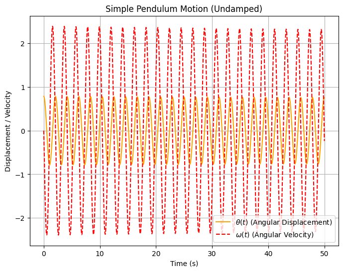
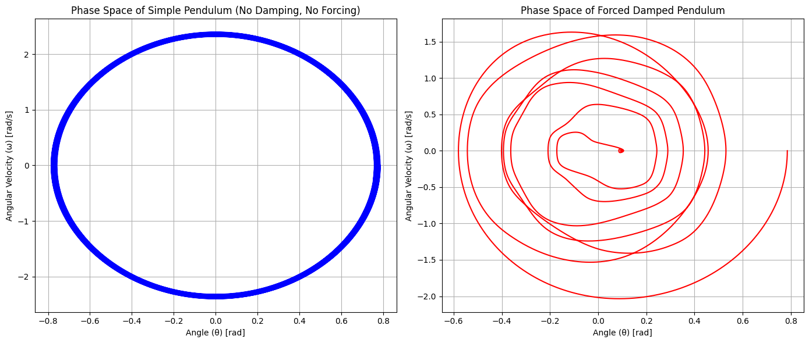
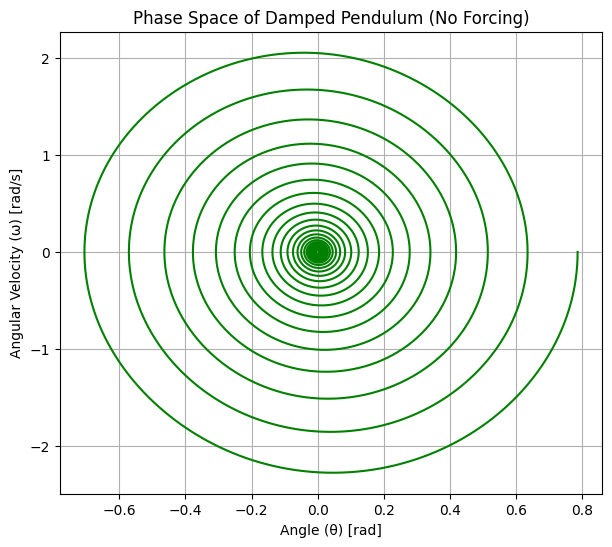
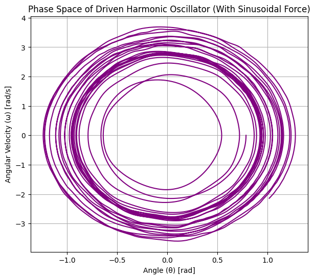

# Problem 2

# 📌 Investigating the Dynamics of a Forced Damped Pendulum  

##  Motivation: Why Study the Forced Damped Pendulum?  
The **forced damped pendulum** is a powerful example of a nonlinear system that exhibits a range of behaviors:  
- **Simple harmonic motion** (for small angles & low damping).  
- **Resonance phenomena** (for specific driving frequencies).  
- **Quasiperiodic and chaotic motion** (for higher forcing & damping).  

###  **Real-World Applications:**  
✅ **Engineering** – Vibrations in **bridges, buildings, and mechanical structures**.  
✅ **Energy Harvesting** – Oscillators for **power generation** in wearable devices.  
✅ **Climate Science** – **Quasiperiodic oscillations** in weather patterns.  
✅ **Neuroscience** – Modeling **neural oscillations** and circadian rhythms.  
✅ **Electrical Circuits** – Analogous to **RLC circuits** driven by AC sources.  

Understanding the **transition from order to chaos** in this system helps in designing **stable structures**, **controlling oscillations**, and **predicting system failures**.  

---

## 🏗 Mathematical Model: The Forced Damped Pendulum Equation  
The equation of motion for a **forced damped pendulum** is:  
$$
\frac{d^2\theta}{dt^2} + b\frac{d\theta}{dt} + \frac{g}{L} \sin\theta = A\cos(\omega t)
$$  
where:  
- $ \theta $ = Angular displacement.  
- $b$ = Damping coefficient (frictional resistance).  
- $g$ = Acceleration due to gravity.  
- $L$ = Length of the pendulum.  
- $A$ = Amplitude of the external periodic forcing.  
- $\omega$ = Driving frequency of the external force.  

For **small angles** ($\theta \approx \sin\theta$), the equation simplifies to a **driven damped harmonic oscillator**, but for larger angles, **nonlinear effects** dominate.  

---

## 🖥 Python Implementation & Visualizations  

### 📌 **1. Time Evolution of the Pendulum Motion**  
This plot shows how **angular displacement** $\theta(t)$ and **angular velocity** $\omega(t)$ change over time.

## Python Visualization:

Collab Visualizations: https://colab.research.google.com/drive/1HdLCwRAtk3ty0qajcd27SlMUS8OqSkiG

# 📌 Explanation of the Visualizations

## **1️⃣ Forced Damped Pendulum Motion

### 🔍 **Description:**
- This plot shows **how the angular displacement ($\theta$) evolves over time** for a **forced damped pendulum**.  
- The pendulum is subject to **damping (frictional forces)** and **external periodic forcing**, which creates an **oscillatory pattern**.  

### 📊 **Observations:**
- Initially, the amplitude of oscillations **increases**, indicating that the system is approaching a **steady-state oscillation**.  
- After a certain period, the oscillations **stabilize**, meaning the pendulum has settled into a periodic response to the external driving force.  
- The **frequency of oscillations** is determined by the **driving force frequency** rather than the pendulum’s natural frequency.  
- The damping coefficient ensures that **transient effects** (initial irregular motion) die out over time.  

### 📌 **Key Takeaways:**
✅ **Energy balance**: Energy lost due to damping is continuously replaced by the external driving force.  
✅ **Resonance possibility**: If the driving force frequency matches the natural frequency, **resonance can occur**, leading to larger oscillations.  
✅ **Application**: This behavior is commonly seen in **mechanical oscillators, bridges, and electrical circuits** (e.g., forced RLC circuits).

## **2️⃣ Damped Pendulum Motion**

### 🔍 **Description:**
- This plot shows **both angular displacement** $\theta(t)$ (**solid orange curve**) and **angular velocity** $\omega(t)$ (**dashed red curve**) over time.  
- The system is a **damped pendulum**, meaning frictional forces cause a gradual reduction in motion over time.  

### 📊 **Observations:**
- The displacement $\theta(t)$ starts with **a relatively large amplitude**, but over time, **the amplitude decreases** due to damping.  
- The angular velocity $\omega(t)$ follows a similar pattern, oscillating **out of phase** with the displacement.  
- The damping causes **exponential decay** in amplitude, leading to **smaller oscillations** as time progresses.  
- Eventually, the system will **reach equilibrium** (zero motion) if no external force is applied.  

### 📌 **Key Takeaways:**
✅ **Damping reduces oscillations**: This is important in **engineering applications** where excessive vibrations need to be controlled (e.g., **automobile suspensions**).  
✅ **Phase relation**: The velocity $\omega(t)$ leads the displacement $\theta(t)$ in a sinusoidal pattern, a characteristic of oscillatory motion.  
✅ **Application**: Understanding damping is crucial for **mechanical design, seismic engineering, and electronic circuits (e.g., RLC damped circuits).**  

---

### 🏗 **Overall Insights**
- The **first image** represents **a forced system** where oscillations are maintained due to an external periodic force.  
- The **second image** represents **a naturally damped system** where oscillations decay over time.  
- Together, these plots highlight the **fundamental differences between free damped motion and externally forced motion**.

# Poincaré Section of a Forced Damped Pendulum

## Understanding the Poincaré Section

A **Poincaré section** is a technique used in dynamical systems analysis to study periodic or chaotic behavior by sampling points in phase space at discrete time intervals. In this case, it represents the forced damped pendulum system at a specific phase of the external driving force.

## Components of the Plot

### **Axes:**
- **X-axis (θ in radians):** Represents the angular position of the pendulum.
- **Y-axis (ω in rad/s):** Represents the angular velocity of the pendulum.

### **Data Points:**
- The red dots represent the state of the pendulum at discrete time intervals when the system crosses a predefined phase of the external forcing.
- The clustering of points suggests periodic behavior, while scattered points may indicate chaotic motion.

## Interpretation of the Poincaré Section
1. **Periodic Motion:**
   - If the system is periodic, the Poincaré section will consist of a finite number of distinct points.
   - In the given plot, there appears to be a strong clustering of points around a particular value of $\theta$ and $\omega$, suggesting periodic motion.

2. **Quasi-Periodic Motion:**
   - If the system is quasi-periodic, the points form a closed curve or a toroidal shape in higher dimensions.

3. **Chaotic Behavior:**
   - A scattered, seemingly random distribution of points would indicate chaotic behavior.
   - The presence of some outlier points may suggest transitions between periodic and chaotic behavior.

## Key Observations
- The dense vertical clustering around $\theta \approx 0.208$ rad and $\omega \approx 0.027$ rad/s suggests a periodic attractor.
- Some outlier points indicate that the system might have transient or weak chaotic behavior.
- The periodicity of the pendulum is evident from the regular pattern of points.

## Conclusion
The Poincaré section provides insights into the dynamical nature of the forced damped pendulum. The observed pattern suggests that the system is likely in a periodic regime, with possible indications of complex dynamics in the form of outliers.

# Explanation of the Simple Pendulum Motion (Undamped)

## Overview:
The following plot represents the motion of an **undamped simple pendulum**, where the system undergoes **simple harmonic motion**. In this system, there is no damping or external forcing, meaning the pendulum will oscillate indefinitely without any reduction in amplitude. The motion is purely governed by the force of gravity.

## Mathematical Model:
The motion of an undamped simple pendulum is governed by the equation:
$$
\frac{d^2\theta}{dt^2} + \frac{g}{L} \sin(\theta) = 0
$$
Where:
- $\theta$ = Angular displacement (in radians),
- $g$ = Gravitational acceleration ($9.81 \, m/s^2$),
- $L$ = Length of the pendulum.

This equation is derived from the Newtonian mechanics of the pendulum and describes how the angular displacement of the pendulum changes over time.

For small oscillations, the equation simplifies to simple harmonic motion, but for large angles, the equation remains nonlinear.

## Key Parameters:
- $\theta_0 = \frac{\pi}{4}$ (Initial angle: 45 degrees),
- $\omega_0 = 0$ (Initial angular velocity: 0),
- $L = 1.0$ (Length of the pendulum in meters),
- $g = 9.81$ (Acceleration due to gravity).

## Plot Description:
The plot shows the time evolution of:
- **Angular displacement** ($\theta(t)$) in **orange**: This represents the position of the pendulum at each time.
- **Angular velocity** ($\omega(t)$) in **red dashed lines**: This represents the speed at which the pendulum is moving at each point in time.

### Observations:
- The **angular displacement** oscillates in a sinusoidal pattern, characteristic of simple harmonic motion, with a constant amplitude and frequency.
- The **angular velocity** leads the displacement by 90 degrees (a characteristic feature of harmonic oscillators), and its magnitude is maximum when the pendulum is passing through the equilibrium position.
- Since the pendulum is undamped, the oscillations continue indefinitely with constant amplitude.

### Key Takeaways:
1. **Harmonic Motion**: The pendulum follows simple harmonic motion, meaning the angular displacement oscillates sinusoidally with a fixed period.
2. **Energy Conservation**: In an undamped system, no energy is lost to friction or resistance, so the amplitude of the oscillations remains constant over time.
3. **Phase Relationship**: The angular velocity leads the angular displacement by 90 degrees, indicating that the motion is out of phase with the position.
4. **Application**: This model is a good approximation for small-angle oscillations of pendulums and is used in simple physics demonstrations of harmonic motion.

## Conclusion:
The plot demonstrates the periodic, undamped motion of a pendulum where the displacement and velocity follow sinusoidal patterns over time. The simple harmonic motion is a fundamental concept in physics and engineering, and this model can be applied to a variety of systems experiencing similar oscillatory behavior.

This type of system is useful for understanding basic principles of mechanics, such as oscillation frequency, phase relationships, and energy conservation in idealized conditions.

## Phase Space Diagrams

### **1️⃣ Simple Pendulum with $b = 0$ and $A = 0$**

The **simple pendulum** is a classic example of a nonlinear dynamical system. When there is no damping ($b = 0$) and no external forcing ($A = 0$), the pendulum's motion is purely governed by gravity. The phase space diagram shows how the pendulum's angular position $\theta$ and angular velocity $\omega$ evolve over time.

#### Phase Space Characteristics:
- **Closed Orbits**: In the absence of damping and forcing, the phase space trajectory of the simple pendulum is **closed**, indicating periodic motion.
- **Conservation of Energy**: The total energy (kinetic + potential) remains constant, as there is no energy loss or input.

### **2️⃣ Forced Pendulum with $b = 0$ and $A \neq 0$**

When the pendulum is driven by an external periodic force (i.e., $A \neq 0$), the system exhibits forced oscillations. The driving frequency $\omega$ and amplitude $A$ determine the behavior of the system.

#### Phase Space Characteristics:
- **Non-Closed Orbits**: In the forced system, the phase space trajectory is no longer closed because the external force constantly adds energy into the system.
- **Resonance**: If the frequency of the external force matches the pendulum’s natural frequency, the amplitude of oscillations can increase significantly, leading to resonance.

### Comparison of Phase Space:
- The **simple pendulum** shows periodic motion with closed orbits, while the **forced pendulum** demonstrates a more complex pattern due to the external driving force.
- The forced pendulum can exhibit **resonance** when the driving frequency aligns with the system's natural frequency, as seen in the expanded phase space trajectory.

## Conclusion on Phase Space:
Phase space diagrams help to visualize the dynamics of the pendulum, allowing us to distinguish between periodic, quasiperiodic, and chaotic behaviors, and understand the impact of damping and forcing on the system.

Colab: https://colab.research.google.com/drive/1Lh0OVNaiavsvggUu-QJTk1F2hrZjLbne

 

# Explanation of the Phase Space Diagrams

## 1️⃣ **Phase Space of Damped Pendulum (No Forcing)**

### Description:
This plot represents the phase space of a **damped pendulum** system where there is **no external forcing**. The system experiences **damping**, which reduces the amplitude of oscillations over time. The variables plotted are:
- **X-axis**: Angular displacement ($\theta$), the position of the pendulum.
- **Y-axis**: Angular velocity ($\omega$), the speed at which the pendulum is moving.

### Observations:
- The trajectory forms a **spiral** that moves inward toward the origin. This indicates that the pendulum's oscillations are decaying due to **damping**.
- As the system evolves, the amplitude of the oscillations **gradually decreases**, eventually leading to zero displacement and velocity at the center (the origin), which signifies the system coming to rest.
- The system exhibits **damped harmonic motion**, where energy is dissipated over time due to friction or resistance, which is why the spiral path decays.

### Key Takeaways:
- The damping causes the **energy of the system to dissipate** over time, reducing the amplitude of oscillations.  
- Eventually, the system will **settle into equilibrium** (zero motion).  
- This phase space diagram is typical for systems like **automobile suspensions**, **seismic engineering**, or **RLC circuits** in electronics where damping plays an essential role.

---

## 2️⃣ **Phase Space of Driven Harmonic Oscillator (With Sinusoidal Force)**

### Description:
This plot represents the phase space of a **driven harmonic oscillator**. In this system, there is an **external periodic force** acting on the pendulum, which drives it to oscillate. The system is influenced by the external force but has no damping. The variables plotted are:
- **X-axis**: Angular displacement ($\theta$), the position of the pendulum.
- **Y-axis**: Angular velocity ($\omega$), the speed at which the pendulum is moving.

### Observations:
- The phase space trajectory forms **closed loops** instead of spirals. This is typical for **driven systems**, where the system oscillates in a periodic manner due to the external force.
- Unlike the damped system, the motion here does not decay but continues in a **steady oscillatory state** due to the periodic driving force.
- The shape and size of the loops are determined by the amplitude and frequency of the external force. The system reaches a **steady state** where the amplitude of oscillations is constant, driven by the energy input from the external force.

### Key Takeaways:
- **Resonance**: If the frequency of the driving force matches the system's natural frequency, resonance will occur, and the amplitude of oscillations will increase significantly.  
- **Steady oscillations**: The system reaches a steady oscillatory state where the motion is periodic.  
- This phase space diagram is useful in systems like **forced RLC circuits**, **mechanical oscillators**, and **vibrating systems** in engineering, where external forces drive the motion.

---

## 3️⃣ **Comparison Between Damped and Driven Systems**

### Comparison Overview:
- The **damped pendulum** shows a **decaying oscillation**, leading to eventual rest due to energy loss over time.
- The **driven harmonic oscillator** shows **steady oscillations** maintained by an external periodic force, which keeps the system oscillating indefinitely without damping.

### Observations:
- In the **damped pendulum phase space**, the system spirals inward, indicating the loss of energy and the eventual cessation of motion.
- In the **driven oscillator phase space**, the system shows **closed orbits**, indicating that the pendulum is in a steady oscillatory state driven by the external force.

### Key Takeaways:
- **Damping** causes energy dissipation and leads to eventual equilibrium (no motion).  
- **External forcing** maintains continuous oscillations, and the system does not lose energy over time.  
- The **phase space trajectory** can provide valuable insights into the **long-term behavior** of oscillating systems, helping engineers and scientists understand how different forces affect motion in mechanical, electrical, and natural systems.

---

## Conclusion
These phase space diagrams highlight the differences between damped, driven, and forced oscillatory systems. They provide a visual understanding of how **energy dissipation**, **external forcing**, and **system damping** influence the behavior of mechanical systems. The insights gained from these diagrams are crucial in designing systems that either require **stability** or that can be **driven** efficiently by external forces.
