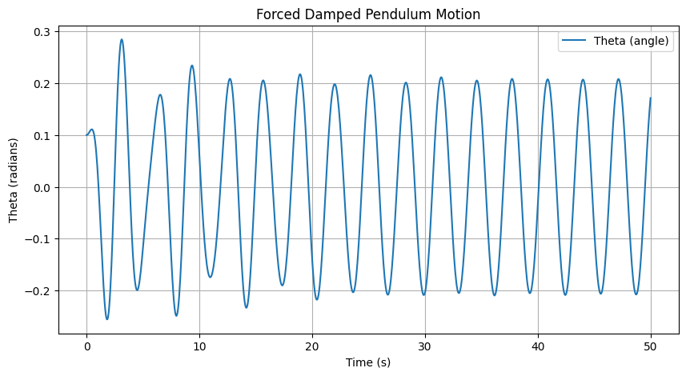
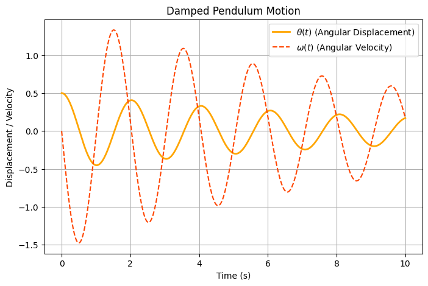

# Problem 2

# 📌 Investigating the Dynamics of a Forced Damped Pendulum  

##  Motivation: Why Study the Forced Damped Pendulum?  
The **forced damped pendulum** is a powerful example of a nonlinear system that exhibits a range of behaviors:  
- **Simple harmonic motion** (for small angles & low damping).  
- **Resonance phenomena** (for specific driving frequencies).  
- **Quasiperiodic and chaotic motion** (for higher forcing & damping).  

###  **Real-World Applications:**  
✅ **Engineering** – Vibrations in **bridges, buildings, and mechanical structures**.  
✅ **Energy Harvesting** – Oscillators for **power generation** in wearable devices.  
✅ **Climate Science** – **Quasiperiodic oscillations** in weather patterns.  
✅ **Neuroscience** – Modeling **neural oscillations** and circadian rhythms.  
✅ **Electrical Circuits** – Analogous to **RLC circuits** driven by AC sources.  

Understanding the **transition from order to chaos** in this system helps in designing **stable structures**, **controlling oscillations**, and **predicting system failures**.  

---

## 🏗 Mathematical Model: The Forced Damped Pendulum Equation  
The equation of motion for a **forced damped pendulum** is:  
$$
\frac{d^2\theta}{dt^2} + b\frac{d\theta}{dt} + \frac{g}{L} \sin\theta = A\cos(\omega t)
$$  
where:  
- $ \theta $ = Angular displacement.  
- $b$ = Damping coefficient (frictional resistance).  
- $g$ = Acceleration due to gravity.  
- $L$ = Length of the pendulum.  
- $A$ = Amplitude of the external periodic forcing.  
- $\omega$ = Driving frequency of the external force.  

For **small angles** ($\theta \approx \sin\theta$), the equation simplifies to a **driven damped harmonic oscillator**, but for larger angles, **nonlinear effects** dominate.  

---

## 🖥 Python Implementation & Visualizations  

### 📌 **1. Time Evolution of the Pendulum Motion**  
This plot shows how **angular displacement** $\theta(t)$ and **angular velocity** $\omega(t)$ change over time.

## Python Visualization:

Collab Visualizations: https://colab.research.google.com/drive/1HdLCwRAtk3ty0qajcd27SlMUS8OqSkiG

# 📌 Explanation of the Visualizations

## **1️⃣ Forced Damped Pendulum Motion

### 🔍 **Description:**
- This plot shows **how the angular displacement ($\theta$) evolves over time** for a **forced damped pendulum**.  
- The pendulum is subject to **damping (frictional forces)** and **external periodic forcing**, which creates an **oscillatory pattern**.  

### 📊 **Observations:**
- Initially, the amplitude of oscillations **increases**, indicating that the system is approaching a **steady-state oscillation**.  
- After a certain period, the oscillations **stabilize**, meaning the pendulum has settled into a periodic response to the external driving force.  
- The **frequency of oscillations** is determined by the **driving force frequency** rather than the pendulum’s natural frequency.  
- The damping coefficient ensures that **transient effects** (initial irregular motion) die out over time.  

### 📌 **Key Takeaways:**
✅ **Energy balance**: Energy lost due to damping is continuously replaced by the external driving force.  
✅ **Resonance possibility**: If the driving force frequency matches the natural frequency, **resonance can occur**, leading to larger oscillations.  
✅ **Application**: This behavior is commonly seen in **mechanical oscillators, bridges, and electrical circuits** (e.g., forced RLC circuits).

## **2️⃣ Damped Pendulum Motion**

### 🔍 **Description:**
- This plot shows **both angular displacement** $\theta(t)$ (**solid orange curve**) and **angular velocity** $\omega(t)$ (**dashed red curve**) over time.  
- The system is a **damped pendulum**, meaning frictional forces cause a gradual reduction in motion over time.  

### 📊 **Observations:**
- The displacement $\theta(t)$ starts with **a relatively large amplitude**, but over time, **the amplitude decreases** due to damping.  
- The angular velocity $\omega(t)$ follows a similar pattern, oscillating **out of phase** with the displacement.  
- The damping causes **exponential decay** in amplitude, leading to **smaller oscillations** as time progresses.  
- Eventually, the system will **reach equilibrium** (zero motion) if no external force is applied.  

### 📌 **Key Takeaways:**
✅ **Damping reduces oscillations**: This is important in **engineering applications** where excessive vibrations need to be controlled (e.g., **automobile suspensions**).  
✅ **Phase relation**: The velocity $\omega(t)$ leads the displacement $\theta(t)$ in a sinusoidal pattern, a characteristic of oscillatory motion.  
✅ **Application**: Understanding damping is crucial for **mechanical design, seismic engineering, and electronic circuits (e.g., RLC damped circuits).**  

---

### 🏗 **Overall Insights**
- The **first image** represents **a forced system** where oscillations are maintained due to an external periodic force.  
- The **second image** represents **a naturally damped system** where oscillations decay over time.  
- Together, these plots highlight the **fundamental differences between free damped motion and externally forced motion**.

# Poincaré Section of a Forced Damped Pendulum

## Understanding the Poincaré Section

A **Poincaré section** is a technique used in dynamical systems analysis to study periodic or chaotic behavior by sampling points in phase space at discrete time intervals. In this case, it represents the forced damped pendulum system at a specific phase of the external driving force.

## Components of the Plot

### **Axes:**
- **X-axis (θ in radians):** Represents the angular position of the pendulum.
- **Y-axis (ω in rad/s):** Represents the angular velocity of the pendulum.

### **Data Points:**
- The red dots represent the state of the pendulum at discrete time intervals when the system crosses a predefined phase of the external forcing.
- The clustering of points suggests periodic behavior, while scattered points may indicate chaotic motion.

## Interpretation of the Poincaré Section
1. **Periodic Motion:**
   - If the system is periodic, the Poincaré section will consist of a finite number of distinct points.
   - In the given plot, there appears to be a strong clustering of points around a particular value of $\theta$ and $\omega$, suggesting periodic motion.

2. **Quasi-Periodic Motion:**
   - If the system is quasi-periodic, the points form a closed curve or a toroidal shape in higher dimensions.

3. **Chaotic Behavior:**
   - A scattered, seemingly random distribution of points would indicate chaotic behavior.
   - The presence of some outlier points may suggest transitions between periodic and chaotic behavior.

## Key Observations
- The dense vertical clustering around $\theta \approx 0.208$ rad and $\omega \approx 0.027$ rad/s suggests a periodic attractor.
- Some outlier points indicate that the system might have transient or weak chaotic behavior.
- The periodicity of the pendulum is evident from the regular pattern of points.

## Conclusion
The Poincaré section provides insights into the dynamical nature of the forced damped pendulum. The observed pattern suggests that the system is likely in a periodic regime, with possible indications of complex dynamics in the form of outliers.
