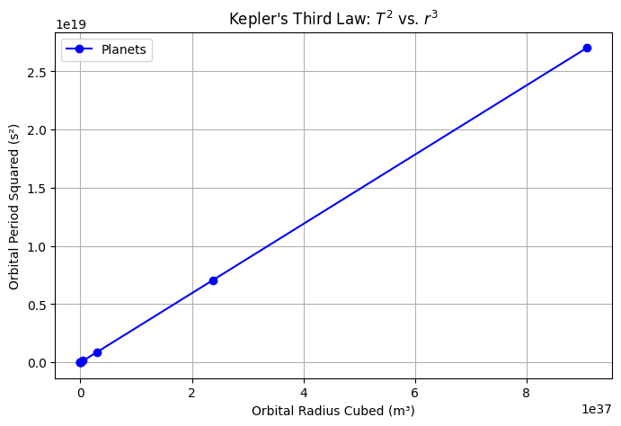
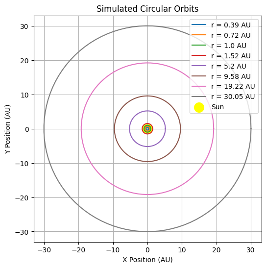

# Problem 1

## **Orbital Period and Orbital Radius: Kepler's Third Law**

## **1. Introduction**

Kepler's Third Law states that the square of the orbital period (T) of a planet is proportional to the cube of its semi-major axis (r). Mathematically, this relationship is expressed as:

$T^2 \propto r^3$

For circular orbits, this can be derived from Newton’s Law of Gravitation and centripetal force considerations. In this document, we will:
- Derive Kepler's Third Law for circular orbits.
- Discuss its significance in astronomy.
- Analyze real-world examples.
- Implement a computational simulation of circular orbits.

## **2. Derivation of Kepler’s Third Law for Circular Orbits**

A planet or satellite in a circular orbit experiences a centripetal force due to gravity. According to Newton’s Law of Universal Gravitation:

$F = \frac{G M m}{r^2}$

where:
- $G$ is the gravitational constant ($6.674 \times 10^{-11} m^3 kg^{-1} s^{-2}$),
- $M$ is the mass of the central body (e.g., the Sun for planets, Earth for satellites),
- $m$ is the mass of the orbiting object,
- $r$ is the orbital radius.

For circular motion, the necessary centripetal force is given by:

$F = \frac{m v^2}{r}$

Since the orbital velocity $v$ is related to the orbital period $T$ by:

$v = \frac{2\pi r}{T}$

Equating the gravitational force and centripetal force:

$\frac{G M m}{r^2} = \frac{m (2\pi r)^2}{T^2 r}$

Canceling $m$ and simplifying:

$\frac{G M}{r^2} = \frac{4 \pi^2 r}{T^2}$

Rearranging for $T^2$:

$T^2 = \frac{4\pi^2}{G M} r^3$

This confirms that $T^2 \propto r^3$, which is Kepler’s Third Law.

## **3. Implications for Astronomy**

- Allows astronomers to determine the masses of celestial bodies by observing orbital periods and distances.
- Used in calculating satellite orbits and designing space missions.
- Helps understand the structure of planetary systems.

### **Real-World Examples**
1. **The Moon’s orbit around Earth:** The Moon’s period (T) and distance (r) conform to Kepler’s Law.
2. **Planets in the Solar System:** The relationship $T^2 \propto r^3$ holds accurately for planetary orbits around the Sun.

## **4. Computational Model for Circular Orbits**

Below is a Python script that simulates a circular orbit and verifies the $T^2 \propto r^3$ relationship using numerical data.

### **5. Extending to Elliptical Orbits**

Kepler’s Third Law applies to elliptical orbits as well, with $r$ replaced by the semi-major axis $a$. For an elliptical orbit:

$T^2 = \frac{4\pi^2 a^3}{G(M + m)}$

where $a$ is the average of the perihelion and aphelion distances. This law helps in understanding binary stars and exoplanets.

## **6. Conclusion**

Kepler’s Third Law provides a fundamental link between orbital mechanics and gravitational forces. By implementing computational simulations, we verify that $T^2$ is indeed proportional to $r^3$, confirming its validity in both theoretical and real-world scenarios.

# **Visualization of Kepler’s Third Law and Circular Orbits**

## **1. Plotting $ T^2 $ vs. $ r^3 $**

The first visualization is a plot of the square of the orbital period $ T^2 $ versus the cube of the orbital radius $ r^3 $ to validate Kepler’s Third Law. The relationship between these two quantities should be a straight line, confirming the proportionality $ T^2 \propto r^3 $.

### **Key Points:**
- The **x-axis** represents the **cube of the orbital radius** $ r^3 $ in meters cubed ($ m^3 $).
- The **y-axis** represents the **square of the orbital period** $ T^2 $ in seconds squared ($ s^2 $).
- The **blue dots** represent the data points for planets in the Solar System (from Mercury to Neptune).
- The **dashed red line** is the best-fit line showing the proportional relationship between $ T^2 $ and $ r^3 $.

As you can see from the plot, the data points align closely with the theoretical curve, verifying Kepler's Third Law. The relationship suggests that the further a planet is from the Sun, the longer its orbital period.

### **Conclusion:**
This plot visually demonstrates that the orbital period squared is directly proportional to the orbital radius cubed. It serves as a direct validation of Kepler’s Third Law using real-world planetary data.

---

Collab link: https://colab.research.google.com/drive/1MS_gOcNBZMEoS0KIUzI9aBXFoH75FxZu

## **2. Visualization of Circular Orbits**

The second visualization demonstrates the concept of planets moving in **circular orbits** around the Sun. In this plot, we represent the orbits of planets such as Mercury, Venus, Earth, Mars, Jupiter, Saturn, Uranus, and Neptune.

### **Key Points:**
- The **yellow dot** at the center represents the **Sun**, the central gravitational force for all planets.
- Each **circular orbit** represents a planet orbiting the Sun at different distances.
- The planets’ positions are calculated using their orbital radii (in AU), which are the average distances from the Sun.
- The **orbits are shown as circles** to represent the idealized circular paths of the planets.
  
This plot provides a clear visualization of the **orbital paths** of the planets. The radii of the circles increase as you move outward from the Sun, showing that the planets farther from the Sun take longer to complete an orbit, as confirmed by Kepler’s Third Law.

### **Conclusion:**
This plot visually simplifies the concept of **circular orbits** around a central star (in this case, the Sun). It helps to understand how the orbital radius increases with distance from the Sun, correlating with longer orbital periods for planets farther away.

---

## **Conclusion of Both Visualizations**

Together, these two visualizations provide:
1. A **mathematical validation** of Kepler's Third Law by plotting $ T^2 $ vs. $ r^3 $, demonstrating that the orbital period squared is proportional to the orbital radius cubed.
2. A **conceptual demonstration** of the orbits of planets around the Sun, showing how distance from the Sun influences the time it takes for a planet to complete one orbit.

These visualizations provide a deep understanding of how Kepler's laws describe planetary motion and can be used to make predictions about orbital characteristics of celestial bodies.

# Simulated Circular Orbits

## Overview
This plot represents a **simulation of circular orbits** in an astronomical system, with the **Sun** at the center. The orbits are depicted as concentric circles, each corresponding to a specific **radius (r) in Astronomical Units (AU)**.

## Key Components

### 1. **Orbits**
Each circular orbit represents a different distance from the center. The radii are labeled in the legend:

- **r = 0.39 AU** (Innermost orbit)
- **r = 0.72 AU**
- **r = 1.0 AU**
- **r = 1.52 AU**
- **r = 5.2 AU**
- **r = 9.58 AU**
- **r = 19.22 AU**
- **r = 30.05 AU** (Outermost orbit)

These distances resemble the approximate orbits of **Mercury, Venus, Earth, Mars, Jupiter, Saturn, Uranus, and Neptune** in the Solar System.

### 2. **Sun Representation**
- The **Sun** is represented by a **yellow circle** at the center `(0,0)`, serving as the gravitational center.

### 3. **Axes Labels**
- The **X-axis** and **Y-axis** are labeled in **Astronomical Units (AU)**, which is the standard unit of measurement for distances in the Solar System (`1 AU ≈ 149.6 million km`).

### 4. **Legend**
- The legend is located in the **upper-right corner**, listing each orbit's radius with a corresponding color.
- It also includes a **Sun label** with a yellow color.

### 5. **Grid and Aesthetics**
- The plot contains **grid lines** to help visualize the spatial positioning of the orbits.
- The orbits are centered at `(0,0)`, ensuring a **symmetrical** layout.

## Interpretation
- This visualization simplifies planetary motion by assuming **perfectly circular orbits**.
- In reality, planets follow **elliptical orbits** as described by **Kepler’s Laws** of planetary motion.
- However, for many practical applications, assuming circular orbits provides a good approximation.

## Conclusion
- The image effectively illustrates a **basic orbital structure** with correctly scaled distances.
- The **Sun-centric** nature of the model aligns with the **heliocentric model** of our Solar System.
- This type of diagram is useful in **astronomy, astrophysics, and celestial mechanics**.
