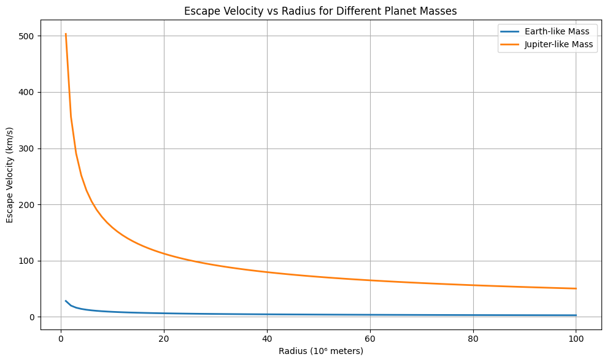
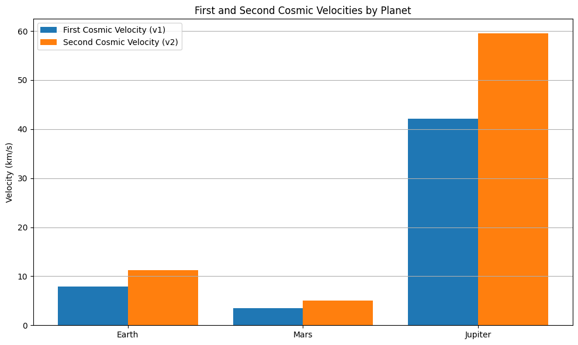

#  Problem 2: 

## Escape Velocities and Cosmic Velocities

##  Motivation
The concept of escape velocity is crucial for understanding the conditions required to leave a celestial body's gravitational influence. Extending this concept, the first, second, and third cosmic velocities define the thresholds for orbiting, escaping, and leaving a star system. These principles underpin modern space exploration, from launching satellites to interplanetary missions.

---

##  Definitions

###  First Cosmic Velocity (Orbital Velocity)

The minimum velocity required for a body to stay in a stable circular orbit around a celestial body near its surface.

- **Physical meaning**: Keeps a satellite in orbit close to the surface without falling back due to gravity.
- **Formula**:  
  $$v_1 = \sqrt{\frac{GM}{R}}$$  
  where:  
  - $G$ = Gravitational constant $ \approx 6.674 \times 10^{-11} \, \text{m}^3/\text{kg s}^2 $
  - $M$ = Mass of the planet  
  - $R$ = Radius of the planet

---

###  Second Cosmic Velocity (Escape Velocity)

The minimum velocity required to escape the gravitational field of a planet, neglecting atmospheric drag.

- **Physical meaning**: Needed to send spacecraft into deep space, free from the planet’s gravity.
- **Formula**:  
  $$v_2 = \sqrt{\frac{2GM}{R}} = \sqrt{2} \cdot v_1$$

---

###  Third Cosmic Velocity (Solar System Escape Velocity)

The minimum velocity required to leave the solar system from a planet’s orbit, overcoming the Sun’s gravity.

- **Physical meaning**: Required to send probes like Voyager 1 & 2 out of the solar system.
- **Formula** (from Earth's orbit):  
  $$v_3 = \sqrt{v_{e,\odot}^2 + v_{o}^2}$$  
  where:
  - $v_{e,\odot}$ = Escape velocity from the Sun at Earth's orbital distance  
  - $v_o$ = Orbital velocity of Earth around the Sun $\approx 29.78 \, \text{km/s}$

---

##  Derivations

### First Cosmic Velocity:
From centripetal force = gravitational force:
$$\frac{mv^2}{R} = \frac{GMm}{R^2}$$  
Cancelling $m$ and solving for $v$:
$$v_1 = \sqrt{\frac{GM}{R}}$$

---

### Second Cosmic Velocity:
Using conservation of energy (total energy = 0 at escape):
$$\frac{1}{2}mv^2 - \frac{GMm}{R} = 0$$  
Solving for $v$:
$$v_2 = \sqrt{\frac{2GM}{R}}$$

---

### Third Cosmic Velocity:
Escape from Sun's gravity from Earth's orbit:
$$v_3 = \sqrt{v_{e,\odot}^2 + v_o^2}$$  
Where:
- $v_{e,\odot} = \sqrt{\frac{2G M_{\odot}}{R_{\text{orbit}}}}$

---

##  Calculations for Earth, Mars, and Jupiter

Let’s define:

- $G = 6.674 \times 10^{-11}$ m³/kg·s²

### Earth:
- $M = 5.972 \times 10^{24} \, \text{kg}$
- $R = 6.371 \times 10^6 \, \text{m}$
- $v_1 \approx 7.91 \, \text{km/s}$
- $v_2 \approx 11.2 \, \text{km/s}$
- $v_3 \approx 42.1 \, \text{km/s}$

### Mars:
- $M = 6.39 \times 10^{23} \, \text{kg}$
- $R = 3.39 \times 10^6 \, \text{m}$
- $v_1 \approx 3.55 \, \text{km/s}$
- $v_2 \approx 5.03 \, \text{km/s}$

### Jupiter:
- $M = 1.898 \times 10^{27} \, \text{kg}$
- $R = 6.9911 \times 10^7 \, \text{m}$
- $v_1 \approx 42.1 \, \text{km/s}$
- $v_2 \approx 59.5 \, \text{km/s}$

---

##  Importance in Space Exploration

- **$v_1$ (Orbital Velocity)**: Crucial for satellites, space stations, and initial orbit insertion.
- **$v_2$ (Escape Velocity)**: Required for deep space missions (e.g., Moon, Mars, interplanetary travel).
- **$v_3$ (Solar System Escape)**: Needed for missions leaving the solar system (e.g., Voyager, New Horizons).

Understanding these velocities allows engineers to plan fuel loads, rocket thrusts, and trajectories for efficient space missions.

---

Collab link https://colab.research.google.com/drive/1ybsC2sLWqxNMcXwTknmFMkRApFqbhZ7A

## Visualization 1: Bar Chart of First and Second Cosmic Velocities

This bar chart compares the **first** and **second cosmic velocities** for **Earth**, **Mars**, and **Jupiter**.

- The **first cosmic velocity ($v_1$)** is the speed required to achieve a stable low orbit around the planet.
- The **second cosmic velocity ($v_2$)** is the speed required to escape a planet’s gravitational field entirely, assuming no atmospheric resistance.

### Observations:
- **Jupiter** has significantly higher values for both $v_1$ and $v_2$ due to its massive size and strong gravity:
  - $v_1 \approx 42.1$ km/s
  - $v_2 \approx 59.5$ km/s
- **Earth** lies in the middle:
  - $v_1 \approx 7.91$ km/s
  - $v_2 \approx 11.2$ km/s
- **Mars** has the lowest values:
  - $v_1 \approx 3.55$ km/s
  - $v_2 \approx 5.03$ km/s

These differences reflect how planetary **mass** and **radius** directly affect the gravitational force and, therefore, the required velocities for space travel.

---

## Visualization 2: Line Plot of Escape Velocity vs Planetary Radius

This plot shows how **escape velocity ($v_2$)** changes with varying **planetary radius**, assuming two different planet masses:
- One with a mass equal to **Earth**
- One with a mass equal to **Jupiter**

### Formula:
$$
v_2 = \sqrt{\frac{2GM}{R}}
$$

Where:
- $G$ is the gravitational constant,
- $M$ is the planet's mass,
- $R$ is the radius of the planet.