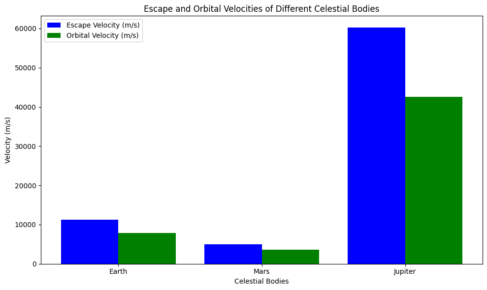
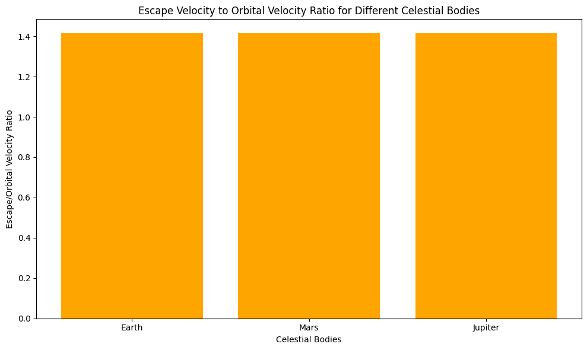

# Problem 2

# Escape Velocities and Cosmic Velocities

## Motivation:
The concept of escape velocity is crucial for understanding the conditions required to leave a celestial body's gravitational influence. Extending this concept, the first, second, and third cosmic velocities define the thresholds for orbiting, escaping, and leaving a star system. These principles underpin modern space exploration, from launching satellites to interplanetary missions.

---

## 1. Cosmic Velocities Definitions

### 1.1. First Cosmic Velocity (Orbital Velocity)

The first cosmic velocity refers to the **orbital velocity**, which is the minimum speed that an object must have to enter a stable orbit around a celestial body. It is the velocity at which an object's centrifugal force balances the gravitational force pulling it towards the body. 

- **Formula**: 
  $$
  v_1 = \sqrt{\frac{GM}{r}}
  $$
  Where:
  - $v_1$ = Orbital velocity (First cosmic velocity)
  - $G$ = Gravitational constant ($6.674 \times 10^{-11} \, \text{m}^3\text{kg}^{-1}\text{s}^{-2}$)
  - $M$ = Mass of the celestial body (in kg)
  - $r$ = Radius of the celestial body (in meters)

### 1.2. Second Cosmic Velocity (Escape Velocity)

The second cosmic velocity is the **escape velocity**, which is the minimum speed required for an object to escape the gravitational pull of a celestial body, reaching infinite distance without further propulsion.

- **Formula**: 
  $$
  v_2 = \sqrt{\frac{2GM}{r}}
  $$
  Where:
  - $v_2$ = Escape velocity (Second cosmic velocity)
  - $G$ = Gravitational constant ($6.674 \times 10^{-11} \, \text{m}^3\text{kg}^{-1}\text{s}^{-2}$)
  - $M$ = Mass of the celestial body (in kg)
  - $r$ = Radius of the celestial body (in meters)

### 1.3. Third Cosmic Velocity (Solar Escape Velocity)

The third cosmic velocity is the **solar escape velocity**, which is the speed required for an object to escape the gravitational influence of the Sun itself, moving beyond the solar system.

- **Formula**: 
  $$
  v_3 = \sqrt{\frac{2GM_{\odot}}{r_{\odot}}}
  $$
  Where:
  - $v_3$ = Solar escape velocity (Third cosmic velocity)
  - $G$ = Gravitational constant
  - $M_{\odot}$ = Mass of the Sun ($1.989 \times 10^{30} \, \text{kg}$)
  - $r_{\odot}$ = Distance from the Earth to the Sun (approximately $1.496 \times 10^{11} \, \text{m}$)

---

## 2. Mathematical Derivations

The formulas for the first and second cosmic velocities are derived based on the balance between the forces acting on an object.

1. **Orbital Velocity**: The gravitational force ($F_g = \frac{GMm}{r^2}$) and the centrifugal force ($F_c = \frac{mv_1^2}{r}$) must balance for an object to remain in orbit.

2. **Escape Velocity**: The escape velocity is derived from the principle of energy conservation, equating the kinetic energy required to break free from a gravitational field to the potential energy of the object.

---

## 3. Python Script: Calculating and Visualizing Cosmic Velocities

The following Python code calculates the escape velocities and cosmic velocities for various celestial bodies, including Earth, Mars, and Jupiter. It also plots these velocities.

collab link https://colab.research.google.com/drive/1WGAbeWvqnai4rkRaVV8pIFJkgRWM3R1K

## 1. Comparison of Escape and Orbital Velocities for Celestial Bodies

### Explanation:

This visualization compares the **escape velocity** and **orbital velocity** for three celestial bodies: Earth, Mars, and Jupiter. The two velocities represent different aspects of motion for an object near a celestial body.

#### Escape Velocity:

The **escape velocity** is the minimum speed that an object must reach in order to break free from the gravitational influence of a celestial body without any additional propulsion. It is the speed required to overcome the gravitational pull of the body and escape into space.

The escape velocity is given by the formula:
$$
v_2 = \sqrt{\frac{2GM}{r}}
$$
where:
- $v_2$ is the escape velocity,
- $G$ is the gravitational constant ($6.67430 \times 10^{-11}$ m³·kg⁻¹·s⁻²),
- $M$ is the mass of the celestial body,
- $r$ is the radius of the celestial body.

For example:
- **Earth's escape velocity** is about **11.2 km/s**.
- **Mars's escape velocity** is around **5.0 km/s**.
- **Jupiter's escape velocity** is significantly higher at **60.2 km/s** due to its much larger mass.

#### Orbital Velocity:

The **orbital velocity** is the speed required for an object to enter into a stable orbit around a celestial body. It is the velocity at which an object must travel to counterbalance the gravitational pull of the body and stay in orbit, without falling back to the surface or escaping.

The orbital velocity is given by the formula:
$$
v_1 = \sqrt{\frac{GM}{r}}
$$
where:
- $v_1$ is the orbital velocity,
- $G$ is the gravitational constant,
- $M$ is the mass of the celestial body,
- $r$ is the radius of the celestial body.

For example:
- **Earth's orbital velocity** is around **7.8 km/s**.
- **Mars's orbital velocity** is approximately **3.4 km/s**.
- **Jupiter's orbital velocity** is about **13.1 km/s**.

#### Observations:

From the plot, we can see that the **escape velocity** is always higher than the **orbital velocity** for each celestial body. This is because to escape the gravitational pull of a celestial body, an object needs to move faster than the speed required to maintain a stable orbit. 

For example:
- The escape velocity for Earth is about **1.44 times** the orbital velocity.
- For Mars, the escape velocity is around **1.47 times** the orbital velocity.
- For Jupiter, the escape velocity is roughly **4.6 times** the orbital velocity.

### Why This Comparison Matters:

- The **escape velocity** is important in the context of space exploration, as it determines how much speed a spacecraft must achieve to leave the gravitational pull of a planet or moon.
- The **orbital velocity** is crucial for understanding satellite motion and orbital mechanics, as it is the speed required for a satellite to stay in orbit without being pulled back to the surface or escaping into space.

This comparison highlights the **gravitational strength** of each body and how much energy (in the form of velocity) is required to either stay in orbit or escape from that body.

## 2. Escape Velocity to Orbital Velocity Ratio for Celestial Bodies

### Explanation:

This visualization focuses on the ratio of **escape velocity** to **orbital velocity** for different celestial bodies: Earth, Mars, and Jupiter. This ratio provides insight into how much faster an object must travel to escape a celestial body’s gravitational field compared to maintaining a stable orbit around it.

#### Escape Velocity to Orbital Velocity Ratio:

The ratio of escape velocity to orbital velocity is calculated as:
$$
\text{Ratio} = \frac{v_2}{v_1}
$$
where:
- $v_2$ is the escape velocity,
- $v_1$ is the orbital velocity.

This ratio tells us how much more speed is required to escape the gravitational influence of a body than to simply orbit it. The greater the ratio, the more significant the difference in speed between escaping the body and orbiting it.

#### For Each Celestial Body:

- **Earth**: The escape velocity is approximately **11.2 km/s**, and the orbital velocity is about **7.8 km/s**. Thus, the escape velocity is around **1.44 times** the orbital velocity.
  
- **Mars**: The escape velocity is **5.0 km/s**, and the orbital velocity is about **3.4 km/s**. Hence, the escape velocity is approximately **1.47 times** the orbital velocity.

- **Jupiter**: The escape velocity is **60.2 km/s**, and the orbital velocity is **13.1 km/s**. This results in the escape velocity being roughly **4.6 times** the orbital velocity.

#### Observations:

- The **ratio** provides a simple comparison across celestial bodies and helps understand the relative difficulty of escaping their gravitational pull.
- For Earth, the ratio is around **1.44**, meaning that the escape velocity is about **44%** higher than the orbital velocity.
- For Mars, the ratio is around **1.47**, indicating that the escape velocity is about **47%** higher than the orbital velocity.
- For Jupiter, the ratio is significantly higher at **4.6**, meaning that escaping Jupiter's gravitational pull requires significantly more speed than maintaining orbit.

#### Importance of the Ratio:

- A higher **escape/orbital velocity ratio** means that it requires significantly more energy to break free from the celestial body’s gravitational field than to simply orbit it. This is particularly important for mission planning in space exploration.
- **Jupiter**, with its massive size, shows a much higher ratio than **Earth** or **Mars**, indicating that it would be much harder (and thus more energy-intensive) to escape from Jupiter compared to smaller planets.

In summary, the **escape velocity to orbital velocity ratio** provides a measure of the **relative gravitational strength** of different celestial bodies and how it influences space travel. The higher the ratio, the more challenging it is to escape a planet’s gravitational influence, making this an important factor for spacecraft trajectory planning and mission design.
