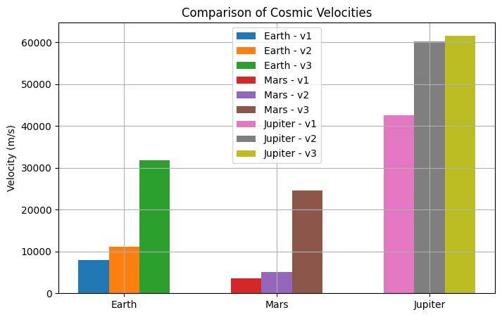

# Problem 2

# **Gravity: Problem 2**
## Escape Velocities and Cosmic Velocities

## **1. Motivation**
Escape velocity is the **minimum speed** an object needs to break free from a celestial body's gravitational pull without further propulsion. This concept is essential in space exploration for launching **rockets, satellites, and interplanetary missions**.

In addition to escape velocity, the **first, second, and third cosmic velocities** define the speeds required for:
1. **Stable orbits (first cosmic velocity)**
2. **Escaping a planet (second cosmic velocity)**
3. **Escaping a star system (third cosmic velocity)**

These principles are key for missions such as:
- **Artificial satellites (first cosmic velocity)**
- **Lunar and Mars missions (second cosmic velocity)**
- **Interstellar exploration (third cosmic velocity)**

---

## **2. Definition of Cosmic Velocities**
### **First Cosmic Velocity (Orbital Velocity)**
The velocity needed to **maintain a stable circular orbit** around a celestial body:

$v_1 = \sqrt{\frac{GM}{r}}$

where:
- $G$ = Gravitational constant ($6.67430 \times 10^{-11} \, \text{m}^3/\text{kg} \cdot \text{s}^2$)
- $M$ = Mass of the celestial body (kg)
- $r$ = Distance from the center (m)

This is the **minimum velocity** required for an object to stay in orbit without falling back.

### **Second Cosmic Velocity (Escape Velocity)**
The velocity required to **escape** the gravitational field of a celestial body:

$v_2 = \sqrt{\frac{2GM}{r}}$

This velocity ensures that an object **never falls back** to the surface.

### **Third Cosmic Velocity (Solar System Escape Velocity)**
The velocity required to **escape a star system** (like the Solar System):

$v_3 = \sqrt{v_2^2 + v_{\text{orbital}}^2}$

where:
- $v_{\text{orbital}}$ is the orbital velocity of the planet around the Sun.

This is the speed needed for **interstellar travel**, such as sending probes beyond the Solar System.

