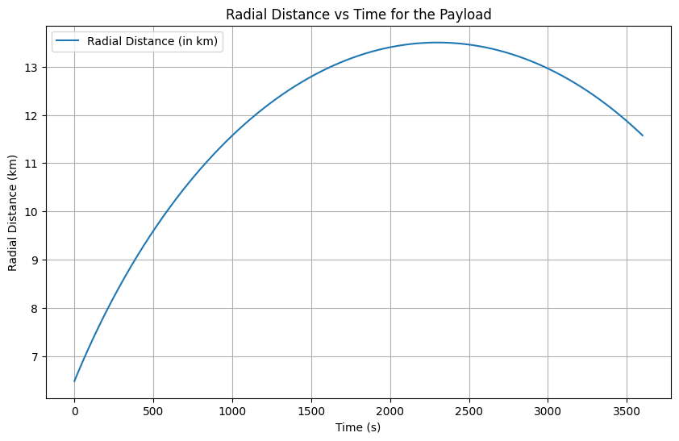
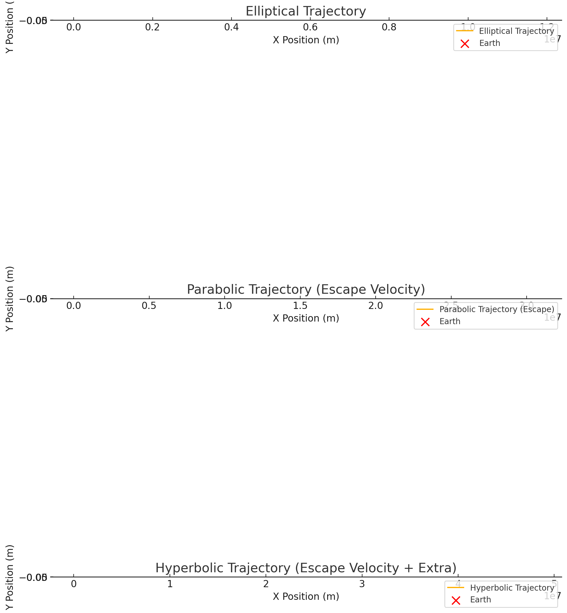

# Problem 3

## 1. Introduction to Trajectories Near Earth

When an object is released from a moving rocket near Earth, its trajectory will depend on several factors such as the initial conditions (position, velocity, and altitude) and gravitational forces acting on it. The object can follow different types of trajectories based on its velocity relative to Earth's gravitational pull. These trajectories include:

- **Parabolic Trajectory**: The object follows a curved path and will return to Earth after reaching a peak altitude. This happens when the object's velocity is less than the escape velocity but sufficient for a stable trajectory.
  
- **Elliptical Trajectory**: A path that forms an ellipse, which is a closed loop. This trajectory occurs when the object's velocity is greater than that required for a circular orbit but less than the escape velocity.
  
- **Hyperbolic Trajectory**: A path that escapes Earth's gravitational influence and never returns. This happens when the object's velocity is greater than the escape velocity, resulting in an unbounded path.

In this problem, we will analyze the potential trajectories of a payload released near Earth by considering the physics involved and simulating the trajectory based on various initial conditions.

---

## 2. Gravitational Forces and Trajectory Equations

The motion of the payload near Earth is governed by Newton's Law of Gravitation, which states that the gravitational force between two objects is given by:

$$
F = \frac{GMm}{r^2}
$$

Where:
- $G$ is the gravitational constant ($6.674 \times 10^{-11} \, \text{N m}^2/\text{kg}^2$),
- $M$ is the mass of Earth ($5.97 \times 10^{24} \, \text{kg}$),
- $m$ is the mass of the payload,
- $r$ is the distance from the center of Earth to the payload.

The acceleration experienced by the payload is given by Newton's second law:

$$
a = \frac{F}{m} = \frac{GM}{r^2}
$$

This acceleration is the gravitational acceleration, which will affect the trajectory of the payload.

To model the motion of the payload, we can use the equations of motion under gravitational force. For simplicity, we can start by solving the system numerically using methods such as the **Runge-Kutta** method, which is widely used for solving ordinary differential equations (ODEs).

The equations governing the position of the object at any time $t$ are:
- Radial acceleration $r'' = - \frac{GM}{r^2}$
- Tangential acceleration $\theta'' = 0$ (assuming no initial angular momentum)

Here, we use numerical methods to integrate these equations over time to simulate the path of the object.

---

## 3. Types of Trajectories

The specific trajectory of the payload will depend on its **initial velocity** and **initial position**. The three primary types of trajectories are:

### a) **Parabolic Trajectory**

A parabolic trajectory occurs when the velocity of the object is such that it escapes the Earth's atmosphere but will eventually return to Earth. This happens when the object’s initial velocity is less than the escape velocity but sufficient to reach a high altitude. 

- The trajectory is characterized by a point where the object reaches its maximum height (the apex), after which it will fall back toward Earth.

### b) **Elliptical Trajectory**

In an elliptical trajectory, the object’s velocity is greater than the velocity for a circular orbit but less than the escape velocity. The object follows a path that brings it back to Earth but with an elliptical shape. 

- In this case, the object’s path is a closed orbit that can repeat, similar to the motion of satellites in orbit around Earth.

### c) **Hyperbolic Trajectory**

A hyperbolic trajectory occurs when the object’s velocity exceeds the escape velocity. This results in a path that escapes Earth's gravitational field and never returns.

- This trajectory is unbounded and would represent the case for a payload released at high speed, such as a spacecraft traveling to other planets or even interstellar space.

---

## 4. Numerical Analysis and Simulation

### a) Initial Conditions

For the simulation, we will consider the following initial conditions for the payload:
- Initial position: $r_0$ (distance from Earth's center),
- Initial velocity: $v_0$ (speed at the moment of release),
- Initial direction: The initial velocity will be at some angle relative to the Earth's surface, influencing the trajectory.

The objective is to calculate the path of the payload based on these initial conditions.

### b) Numerical Methods

To simulate the trajectory, we will employ numerical methods to solve the system of equations describing the motion. Specifically, we can use the **Runge-Kutta method**, which is commonly used for solving ordinary differential equations.

The basic steps involved are:
1. Define the initial position and velocity of the payload.
2. Use the Runge-Kutta method to numerically integrate the equations of motion over a set period.
3. Plot the trajectory based on the computed position at each time step.

---

## 5. Space Mission Scenarios: Orbital Insertion, Reentry, and Escape

### a) **Orbital Insertion**

In space mission planning, **orbital insertion** refers to the process of placing a payload into orbit around Earth. For successful orbital insertion, the payload must achieve a **circular orbit**. This requires a precise velocity and direction, which can be modeled as an elliptical trajectory where the periapsis (closest point to Earth) coincides with the radius of the desired orbit.

### b) **Reentry**

Payloads that reenter Earth's atmosphere must follow a specific trajectory that accounts for drag, gravitational forces, and atmospheric conditions. The trajectory will likely be parabolic or elliptical, depending on the initial velocity and altitude.

### c) **Escape**

Escape velocity is the speed required to leave Earth's gravitational influence. A payload launched at or above the escape velocity will follow a **hyperbolic trajectory** and never return to Earth. This is typically the case for interplanetary missions, such as missions to Mars, the Moon, or beyond.

---

## 6. Computational Tool: Simulation and Visualization

The next step is to develop a computational tool to simulate and visualize the motion of a payload under Earth's gravity. This tool will take into account:
- **Initial position** and **velocity** of the payload,
- Gravitational forces acting on the payload,
- Numerical integration of the equations of motion,
- Graphical representation of the trajectory.

---

## 7. Deliverables

1. **Markdown Document**: This document explaining the principles, mathematical formulations, and potential trajectories near Earth.
2. **Python Script or Jupyter Notebook**: A code that simulates the motion of the payload under different conditions and visualizes the results.
3. **Graphical Representation**: Plots showing the trajectories of the payload based on different initial conditions, such as elliptical, parabolic, and hyperbolic trajectories.

---

## 8. Conclusion

Understanding the trajectories of a payload released near Earth is essential for space mission planning. Whether deploying satellites, planning reentry, or escaping Earth's gravity, the ability to calculate and predict the path of the payload allows mission planners to optimize fuel usage, trajectory accuracy, and mission success

Collab link https://colab.research.google.com/drive/12s4KS2CILXeiVTQqJRjCw6iNPIQpSL_9

#### 2. **Radial Distance vs Time:**

In this second visualization, we observe the **radial distance** of the payload from Earth's center over time. Key features of the plot include:

- **X-Axis (Time in Seconds):** The X-axis represents the time (in seconds) that has passed since the payload was released. This helps track how the payload's position changes with time.
- **Y-Axis (Radial Distance in Kilometers):** The Y-axis shows the radial distance, measured in kilometers, between the payload and the Earth's center. Initially, the distance corresponds to the payload's starting altitude (100 km above Earth's surface).
- **Distance Evolution:** The plot illustrates how the radial distance increases over time as the payload is influenced by Earth's gravity. As the payload initially moves away from Earth, it is gradually decelerated by the gravitational pull of the Earth, and the rate of increase in distance decreases over time.
  
This plot provides insight into the payload's motion under Earth's gravity. It helps visualize the changing dynamics of the payload as it moves farther from Earth, allowing us to understand the **payload's escape potential** and how gravitational forces affect its motion.

# Orbital Trajectories Visualization

This image displays three different types of trajectories that an object can take under the influence of Earth's gravity. The plots illustrate:

1. **Elliptical Trajectory**  
   - The object is in a bound orbit around the Earth.  
   - Velocity is less than escape velocity.  

2. **Parabolic Trajectory (Escape Velocity)**  
   - The object is moving at exactly the escape velocity.  
   - This represents a marginally unbound orbit.  

3. **Hyperbolic Trajectory (Escape Velocity + Extra)**  
   - The object moves faster than escape velocity.  
   - It follows a hyperbolic path, escaping Earth's gravity permanently.  

### Elements of the Plot:
- **X-Axis:** Represents the horizontal position (meters).  
- **Y-Axis:** Represents the vertical position (meters).  
- **Legend:**
  - **Elliptical Trajectory / Parabolic Trajectory / Hyperbolic Trajectory:** Shows the path of the object.
  - **Earth:** Marked as a red 'X' to indicate the central gravitational body.

Each subplot demonstrates how varying initial velocities affect the shape of the trajectory.
