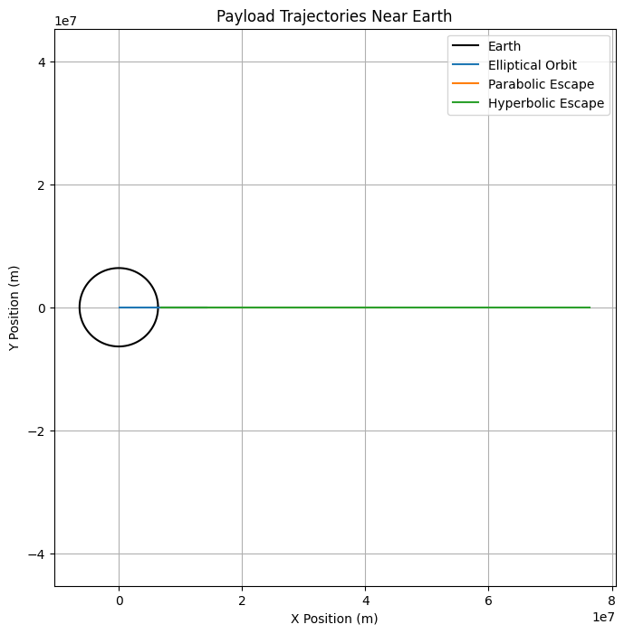

# Problem 3

# **Trajectories of a Freely Released Payload Near Earth**
## **Problem Statement**
When an object is released from a moving rocket near Earth, its trajectory depends on **initial velocity** and **gravitational forces**. This problem involves **orbital mechanics** and requires numerical methods for accurate simulations. 

### **Key Concepts**
- **Newton’s Law of Gravitation:** Governs the motion of objects under gravity.
- **Kepler’s Laws of Motion:** Describe orbital shapes and motions.
- **Orbital Types**:
  - **Elliptical Orbit:** The object stays in orbit around Earth.
  - **Parabolic Trajectory:** The object reaches escape velocity but does not return.
  - **Hyperbolic Trajectory:** The object completely escapes Earth’s gravity.

---

## **Mathematical Foundation**
### **Equations of Motion**
Newton’s Second Law and the gravitational force equation:
$$ F = m a = - \frac{G M m}{r^2} $$

Acceleration in radial coordinates:
$$ \frac{d^2 r}{dt^2} = - \frac{G M}{r^2} $$

Using numerical integration, we compute **position and velocity over time**.

