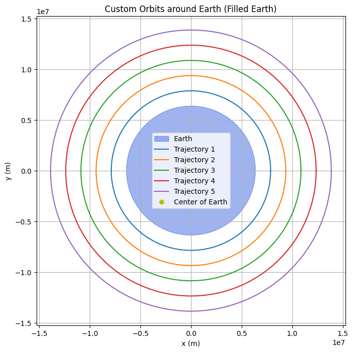
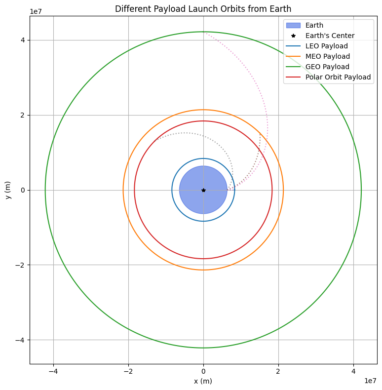
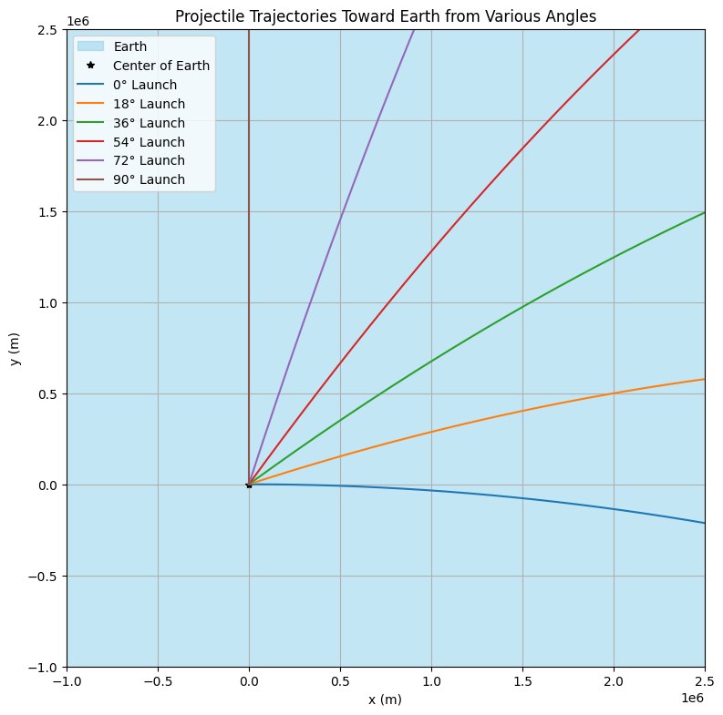
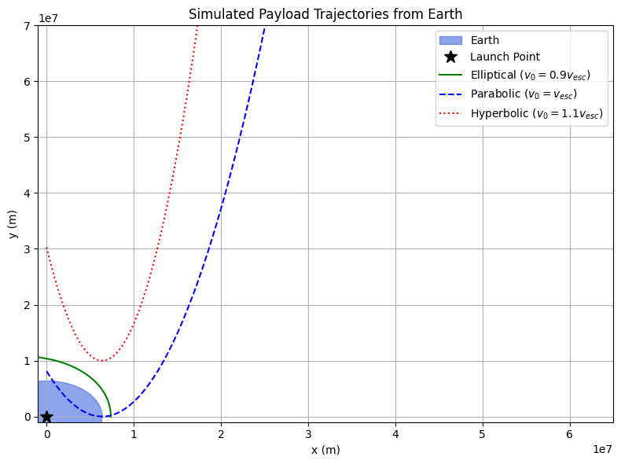

# Problem 3

# 1. Introduction to Trajectories Near Earth

When an object is released from a moving rocket near Earth, its trajectory depends on:
- Initial position
- Initial velocity and direction
- Altitude (distance from Earth)
- Gravitational force

The object may follow one of the following paths:

- **Parabolic Trajectory**: Curved, object returns to Earth.
- **Elliptical Trajectory**: Stable orbit around Earth.
- **Hyperbolic Trajectory**: Escapes Earth permanently.

---

# 2. Gravitational Forces and Trajectory Equations

## Newton's Law of Universal Gravitation:

$F = \frac{GMm}{r^2}$

Where:
- $G = 6.674 \times 10^{-11} \, \text{Nm}^2/\text{kg}^2$
- $M = 5.97 \times 10^{24} \, \text{kg}$ (mass of Earth)
- $m$ = mass of the payload
- $r$ = distance from Earth's center

## Acceleration due to gravity:

From Newton’s Second Law:

$a = \frac{F}{m} = \frac{GM}{r^2}$

---

# 3. Key Velocity Calculations

## a) Orbital Velocity (Circular Orbit)

The velocity required to maintain a circular orbit at a given altitude is:

$v_{orbital} = \sqrt{\frac{GM}{r}}$

**Example**: LEO (Low Earth Orbit), altitude = 300 km  
$r = R_{Earth} + 300 \times 10^3 = 6.371 \times 10^6 + 300 \times 10^3$

$v = \sqrt{\frac{6.674 \times 10^{-11} \times 5.97 \times 10^{24}}{6.671 \times 10^6}} \approx 7.73 \, \text{km/s}$

---

## b) Escape Velocity

The speed required to escape Earth's gravity from distance $r$:

$v_{escape} = \sqrt{\frac{2GM}{r}}$

**Example**: From Earth's surface:

$v = \sqrt{\frac{2 \times 6.674 \times 10^{-11} \times 5.97 \times 10^{24}}{6.371 \times 10^6}} \approx 11.2 \, \text{km/s}$

---

# 4. Types of Trajectories

## a) Parabolic Trajectory

Occurs when $v < v_{escape}$ but is sufficient to escape the lower atmosphere.

- The object follows a high arc.
- Returns to Earth.
- Example: ballistic missiles, suborbital flights.

## b) Elliptical Trajectory

When $v_{circular} < v < v_{escape}$

- Object follows a closed elliptical path.
- Common for satellites, space stations.
- The shape depends on the object's velocity and launch angle.

## c) Hyperbolic Trajectory

When $v > v_{escape}$

- The object escapes Earth's gravity.
- Used in interplanetary missions.
- The path is open and unbounded.

---

# 5. Numerical Analysis and Simulation

## a) Initial Conditions

To simulate a payload’s path, define:
- Initial position $r_0$
- Initial velocity $v_0$
- Launch angle relative to the surface

These values determine the shape and behavior of the trajectory.

## b) Runge-Kutta Method for Numerical Solution

Equations of motion (radial and tangential components):

- Radial acceleration: $r'' = -\frac{GM}{r^2}$
- Angular momentum conserved: $\theta'' = 0$ (if no torque)

Steps:
1. Initialize position and velocity vectors.
2. Apply the Runge-Kutta 4th-order method.
3. Integrate over time to obtain position at each step.
4. Plot the resulting path.

---

# 6. Mission Scenarios

## a) Orbital Insertion

Achieving a circular or elliptical orbit by providing just the right velocity and direction:

- Used in satellite deployments.
- Requires $v_{orbital}$ depending on altitude.

## b) Reentry

Reentry involves:
- Decreasing velocity
- Following a curved (parabolic or elliptical) descent path
- Heat shielding required due to atmospheric drag

## c) Escape Missions

For interplanetary travel:

- Launch at $v \geq v_{escape}$
- Achieve a hyperbolic trajectory
- Apply additional velocity for specific missions (e.g., Hohmann transfers to Mars)

---

# 7. Summary Table

| Trajectory Type | Condition                  | Returns to Earth | Use Case                      |
|------------------|-----------------------------|-------------------|-------------------------------|
| Parabolic        | $v < v_{escape}$            | Yes               | Missiles, suborbital flights  |
| Elliptical       | $v_{circular} < v < v_{escape}$ | Possibly          | Satellites, ISS              |
| Hyperbolic       | $v > v_{escape}$            | No                | Space probes, escape missions |

---

## 6. Computational Tool: Simulation and Visualization

The next step is to develop a computational tool to simulate and visualize the motion of a payload under Earth's gravity. This tool will take into account:
- **Initial position** and **velocity** of the payload,
- Gravitational forces acting on the payload,
- Numerical integration of the equations of motion,
- Graphical representation of the trajectory.

---

## 7. Deliverables

1. **Markdown Document**: This document explaining the principles, mathematical formulations, and potential trajectories near Earth.
2. **Python Script or Jupyter Notebook**: A code that simulates the motion of the payload under different conditions and visualizes the results.
3. **Graphical Representation**: Plots showing the trajectories of the payload based on different initial conditions, such as elliptical, parabolic, and hyperbolic trajectories.

---

## 8. Conclusion

Understanding the trajectories of a payload released near Earth is essential for space mission planning. Whether deploying satellites, planning reentry, or escaping Earth's gravity, the ability to calculate and predict the path of the payload allows mission planners to optimize fuel usage, trajectory accuracy, and mission success

Collab link https://colab.research.google.com/drive/1xPKSuUGUp-5Plk2yaw83vN3Ep9QA9Kg7

### Visualization 1: Custom Orbits around Earth (Filled Earth)

This plot represents circular orbital trajectories around Earth. The Earth is shown as a filled blue circle centered at the origin.

- **Blue Circle**: Represents Earth with radius 6,371 km.
- **Colored Rings**: Represent different circular orbital trajectories at increasing altitudes (e.g., low Earth orbit, medium Earth orbit, etc.).
- **Yellow Dot**: Marks the center of the Earth.

Each trajectory shows what a stable orbit would look like if a satellite were launched at different distances from the Earth's center.

This setup assumes Earth is not rotating, and the trajectories are idealized and free of atmospheric drag.

### Visualization 2: Different Payload Launch Orbits from Earth

This plot shows various payloads being launched into different orbital paths from Earth.

- **Blue Circle**: Earth.
- **Colored Circular Paths**:
  - **LEO (Low Earth Orbit)**: Close proximity to Earth, used for satellites like Starlink.
  - **MEO (Medium Earth Orbit)**: Typically for GPS satellites.
  - **GEO (Geostationary Orbit)**: Used for communications satellites; orbit period matches Earth’s rotation.
  - **Polar Orbit**: Passes over Earth's poles; useful for Earth observation.

- **Dotted Arcs**: Represent launch curves transitioning from Earth’s surface to their respective target orbits.

This visual demonstrates how a single rocket launch could deploy different payloads into various orbital regimes by adjusting velocity, trajectory, and altitude.

### Visualization 3: Simulated Payload Trajectories from Earth

This plot shows the paths a payload might follow when launched from Earth with different initial velocities:

- **Green Line (Elliptical)**: Initial velocity is 90% of escape velocity. The object follows an elliptical orbit and eventually falls back to Earth.
- **Blue Dashed Line (Parabolic)**: Velocity is exactly equal to escape velocity. The object follows a parabolic trajectory and escapes Earth's gravity without returning.
- **Red Dotted Line (Hyperbolic)**: Velocity is greater than escape velocity. The object escapes Earth and continues moving away on a hyperbolic trajectory.

The escape velocity from Earth's surface is approximately **11.2 km/s**. These trajectories originate from a common launch point near the surface.

### Visualization 4: Projectile Trajectories Toward Earth from Various Angles

This plot simulates projectile motion from a fixed launch point using different launch angles.

- **Launch Angles**: Vary from 0° to 90°.
- **Each Curve**: Represents a parabolic trajectory affected by Earth's gravity.
- **Earth**: Depicted as a filled circle to show the target.

Gravity pulls the projectile downward over time, and each trajectory represents how far and how high the projectile travels depending on its launch angle. At 90°, the projectile goes straight up and comes straight down. At lower angles, the trajectory becomes more horizontal.
