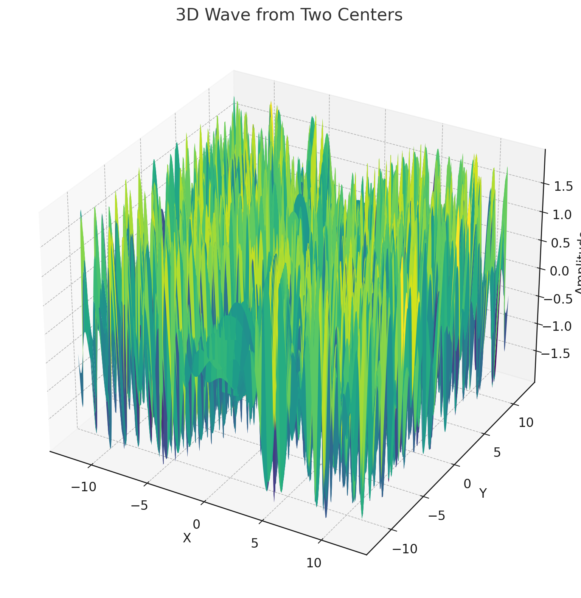

# Problem 1

# Interference Patterns on a Water Surface

## Motivation:
Interference is a fundamental phenomenon in wave mechanics, where waves from different sources overlap and combine to form new patterns. On a water surface, this can be readily observed when ripples from different points meet, leading to the formation of interference patterns. These patterns can demonstrate various interactions, including constructive interference (wave reinforcement) and destructive interference (wave cancellation).

Understanding these interference patterns helps us gain insights into wave behavior in a simple, visual manner. This is essential for grasping the principles of wave superposition and how multiple waves interact. Moreover, it offers an engaging and practical approach to exploring wave dynamics, which has applications in various real-world scenarios, such as acoustics, optics, and fluid dynamics.

## Task:

The goal of this task is to analyze the interference patterns that arise when waves are emitted from multiple point sources placed at the vertices of a regular polygon. Each point source emits a circular wave described by the Single Disturbance equation:

$$
\eta(x, y, t) = \frac{A}{\sqrt{r}} \cdot \cos(k r - \omega t + \phi)
$$

Where:
- $\eta(x, y, t)$ represents the displacement of the water surface at point $(x, y)$ at time $t$.
- $A$ is the amplitude of the wave.
- $k = \frac{2\pi}{\lambda}$ is the wave number, which is related to the wavelength $\lambda$.
- $\omega = 2\pi f$ is the angular frequency, related to the frequency $f$ of the wave.
- $r = \sqrt{(x - x_0)^2 + (y - y_0)^2}$ is the distance between the source located at $(x_0, y_0)$ and the observation point $(x, y)$.
- $\phi$ is the initial phase of the wave.

## Problem Statement:

We are tasked with studying the interference patterns formed on a water surface when multiple point sources of waves are placed at the vertices of a regular polygon (e.g., an equilateral triangle, square, regular pentagon, etc.). The objective is to:
1. Set up the wave equations for each source.
2. Apply the principle of superposition by summing the displacements from all sources.
3. Analyze the resulting interference patterns to identify regions of constructive and destructive interference.

### Steps to Follow:

#### 1. **Select a Regular Polygon**:
   The first step is to choose a regular polygon. Common choices include:
   - **Equilateral triangle** (3 vertices),
   - **Square** (4 vertices),
   - **Regular pentagon** (5 vertices), and so on.

   Each polygon has a specific number of vertices, which will determine the number of point sources from which the waves emanate.

#### 2. **Position the Sources**:
   The sources are placed at the vertices of the selected polygon. In polar coordinates, the vertices are evenly distributed on a circle. The angle between consecutive sources can be calculated as:
   
   $$ \theta_i = \frac{2\pi i}{N} \quad \text{for} \quad i = 0, 1, \dots, N-1 $$
   
   Where $N$ is the number of sources (or the number of vertices of the polygon). The positions of the sources are then:
   
   $$ x_i = R \cos(\theta_i) $$
   $$ y_i = R \sin(\theta_i) $$

   Where $R$ is the radius of the circle inscribed around the polygon.

#### 3. **Write the Wave Equations**:
   Each source emits a wave described by the equation:
   
   $$ \eta_i(x, y, t) = \frac{A}{\sqrt{r_i}} \cdot \cos(k r_i - \omega t + \phi) $$
   
   Where $r_i$ is the distance from the source at $(x_i, y_i)$ to the point $(x, y)$:
   
   $$ r_i = \sqrt{(x - x_i)^2 + (y - y_i)^2} $$

#### 4. **Superposition of Waves**:
   The total displacement at any point $(x, y)$ on the water surface is the sum of the displacements caused by all the sources. According to the principle of superposition:
   
   $$ \eta_{\text{sum}}(x, y, t) = \sum_{i=1}^{N} \eta_i(x, y, t) $$

   The total displacement results from adding the contributions from all sources. Depending on the relative phases of the waves from the sources, we may observe regions of constructive interference (where the waves reinforce each other) or destructive interference (where the waves cancel each other out).

#### 5. **Analyze Interference Patterns**:
   The interference patterns can be visualized by plotting the total displacement $\eta_{\text{sum}}(x, y, t)$ at various points on the water surface. Regions of constructive interference will show up as areas of high displacement, while regions of destructive interference will show low or zero displacement.

   By examining the patterns for different polygons, we can observe how the symmetry and number of sources affect the interference.

Colab Visualizations: https://colab.research.google.com/drive/1GeyAPchrlodXF4B5WXIblvuSDmE1Q2FH

!

# Explanation of the Interference Pattern Visualization

The code provided simulates and visualizes the interference patterns created by waves emitted from point sources placed at the vertices of a regular polygon (in this case, an equilateral triangle with 3 sources). The goal of the visualization is to show how the superposition of waves from multiple sources creates a complex interference pattern on a water surface.

### Visualization Overview:

The plot generated by the code is a **contour plot** that represents the displacement of the water surface at each point on the grid. The color intensity in the plot corresponds to the displacement of the water surface at that point, with warmer colors (like red) representing regions of higher displacement (constructive interference), and cooler colors (like blue) representing regions of lower displacement (destructive interference).

### Key Features of the Visualization:

1. **Grid Representation**:
   - The water surface is modeled as a 2D grid of points in the $x$ and $y$ directions. This grid is created using `np.meshgrid`, which generates a grid of points from the $x$ and $y$ ranges defined earlier.
   - The grid spans from `-size` to `size` in both the $x$ and $y$ directions, giving a 2D plane on which the wave displacements are calculated.

2. **Source Placement**:
   - The point sources (located at the vertices of a regular polygon) are positioned on a circle with a radius of 3 units. For an equilateral triangle, the vertices are placed at 120-degree intervals around this circle.
   - The positions of the sources are calculated using the `cos` and `sin` functions based on the angle `theta`, which is evenly spaced between the sources.

3. **Wave Displacement Calculation**:
   - For each point on the grid, the displacement is calculated by summing the contributions from each point source using the formula:
   
   $$
   \eta_i(x, y, t) = \frac{A}{\sqrt{r}} \cdot \cos(k r - \omega t + \phi)
   $$
   
   Where:
   - $r$ is the distance from the source to the grid point $(x, y)$.
   - $A$ is the amplitude of the wave, $\lambda$ is the wavelength, $f$ is the frequency, and $\phi$ is the phase.
   
   The total displacement $\eta_{\text{sum}}(x, y, t)$ is the sum of the displacements from all sources.

4. **Interference Pattern**:
   - The interference pattern shows regions where the waves from the different sources interact. Areas of **constructive interference** occur where the waves reinforce each other, leading to higher displacement values (depicted as warmer colors in the plot).
   - Conversely, areas of **destructive interference** occur where the waves cancel each other out, leading to lower displacement values (depicted as cooler colors in the plot).

5. **Color Map**:
   - The `contourf` function is used to create filled contour plots, which show the intensity of the displacement. The `RdBu` colormap is used to represent the positive and negative displacements, with red indicating higher displacement (constructive interference) and blue indicating lower displacement (destructive interference).
   - A color bar is included to help interpret the displacement values, with higher values corresponding to regions of constructive interference.

6. **Title and Axes**:
   - The plot title indicates the number of sources used in the simulation (in this case, 3 sources, corresponding to an equilateral triangle).
   - The axes represent the $x$ and $y$ coordinates on the water surface. The plot is scaled to ensure the axes have equal lengths, meaning the aspect ratio of the plot is kept consistent (`plt.axis("equal")`).

### Observations:
- In the case of the **equilateral triangle** (3 sources), the plot shows a **symmetrical interference pattern**. The central region of the plot likely exhibits **constructive interference** with high displacement, while areas further from the center show alternating regions of constructive and destructive interference.
- The **symmetry of the polygon** influences the shape and spacing of the interference fringes. For example, for 3 sources, the pattern will have rotational symmetry around the center of the polygon.
- As the number of sources (vertices of the polygon) increases, the interference pattern will become more complex and may show finer fringes of constructive and destructive interference.

### Conclusion:
This visualization helps to illustrate the principles of wave superposition and interference. By analyzing the interference pattern, we can gain insights into how multiple coherent wave sources interact and how their positions affect the resulting pattern of constructive and destructive interference.

# Explanation of the Interference Pattern for a Square Configuration

The generated plot represents the interference pattern created by waves emitted from four point sources placed at the vertices of a square. Similar to the previous simulation with an equilateral triangle, the goal here is to visualize how the superposition of waves from multiple sources creates regions of constructive and destructive interference.

### Visualization Overview:

The plot is a **contour plot** that shows the displacement of the water surface at each point on the grid. The intensity of the color corresponds to the displacement, with warmer colors (like red) representing higher displacement (constructive interference), and cooler colors (like blue) representing lower displacement (destructive interference).

### Key Features of the Visualization:

1. **Source Placement**:
   - The point sources are positioned at the vertices of a **square**. The coordinates of the four sources are at $(x_1, y_1) = (-3, 3)$, $(x_2, y_2) = (3, 3)$, $(x_3, y_3) = (3, -3)$, and $(x_4, y_4) = (-3, -3)$. These points are evenly spaced at 90-degree intervals.
   
2. **Grid Representation**:
   - The grid spans from `-size` to `size` in both $x$ and $y$ directions, creating a 2D plane that represents the water surface. The displacement at each point on the grid is calculated based on the superposition of waves from the four sources.

3. **Wave Displacement Calculation**:
   - The displacement at each point $(x, y)$ is calculated by summing the contributions of the four sources using the wave formula:
   
   $$
   \eta_i(x, y, t) = \frac{A}{\sqrt{r}} \cdot \cos(k r - \omega t + \phi)
   $$
   
   Where $r$ is the distance between the source at $(x_i, y_i)$ and the observation point $(x, y)$, and $A$ is the amplitude of the wave.

4. **Interference Pattern**:
   - The resulting interference pattern exhibits regions of **constructive interference**, where the waves from multiple sources reinforce each other, and **destructive interference**, where the waves cancel each other out.
   - The plot shows alternating regions of higher and lower displacement, with constructive interference leading to higher displacement (shown in warmer colors) and destructive interference leading to lower displacement (shown in cooler colors).

5. **Color Map**:
   - The `contourf` function is used to create filled contours, which display the intensity of the displacement. The `RdBu` colormap is used, with red colors indicating high displacement (constructive interference) and blue colors indicating low displacement (destructive interference).
   - A color bar is included to indicate the displacement values corresponding to different colors.

6. **Symmetry**:
   - The square configuration introduces **fourfold symmetry** in the interference pattern. The pattern is symmetric around the center of the square, with alternating regions of constructive and destructive interference appearing in each quadrant.

### Observations:
- The interference pattern generated by the four sources placed at the vertices of a square shows clear **symmetry**. This symmetry is a result of the equal spacing between the sources and their arrangement at 90-degree intervals.
- **Constructive interference** occurs near the center of the square, where the waves from the sources meet in-phase and reinforce each other, leading to higher displacement.
- **Destructive interference** occurs at other regions, where the waves from different sources meet out-of-phase and cancel each other out, leading to lower displacement.

