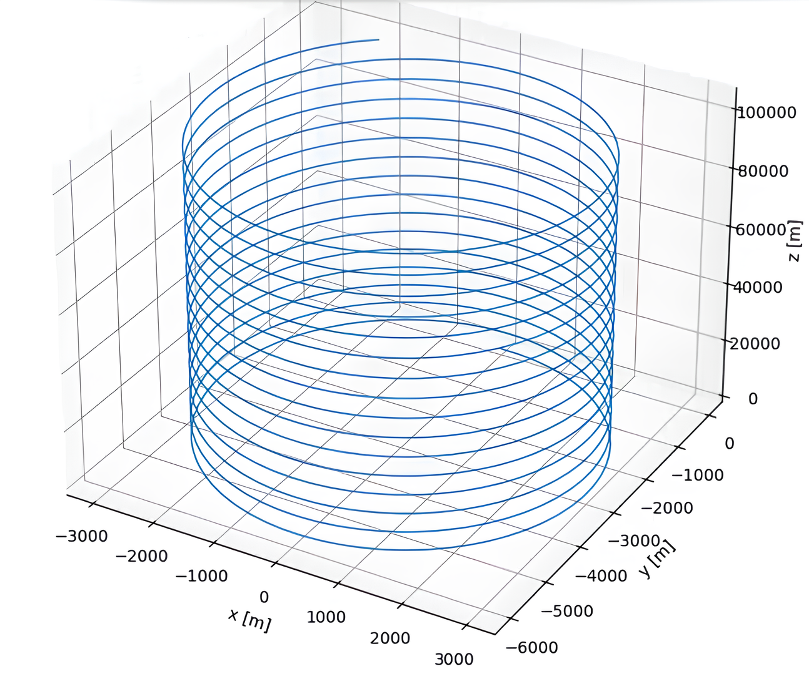
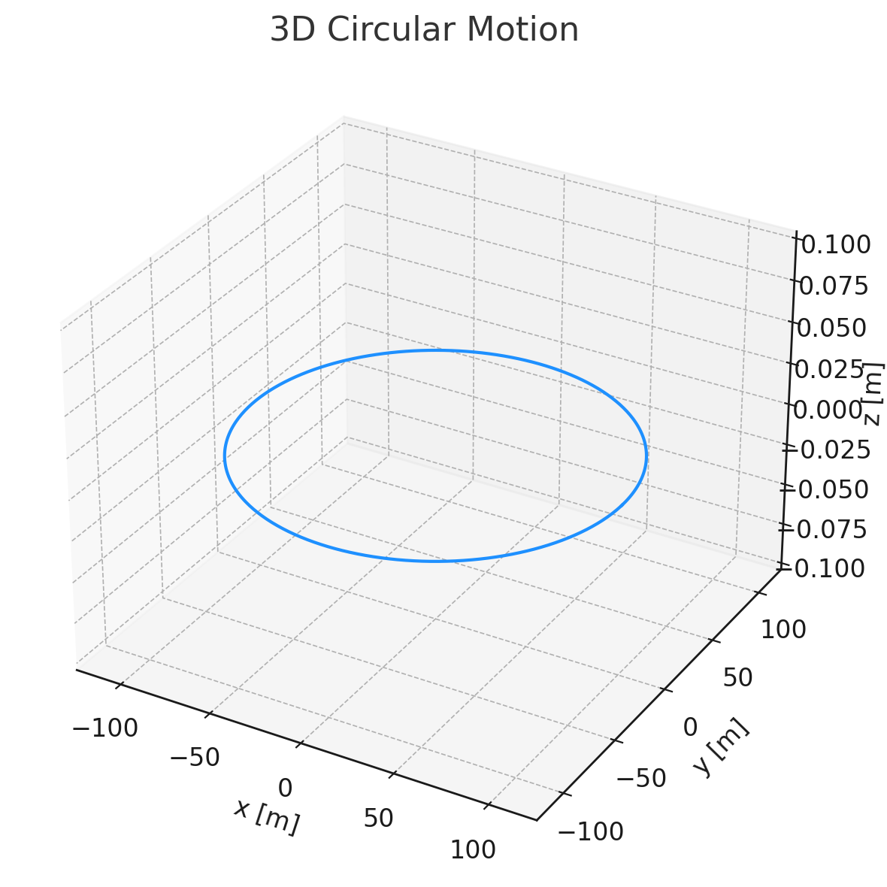
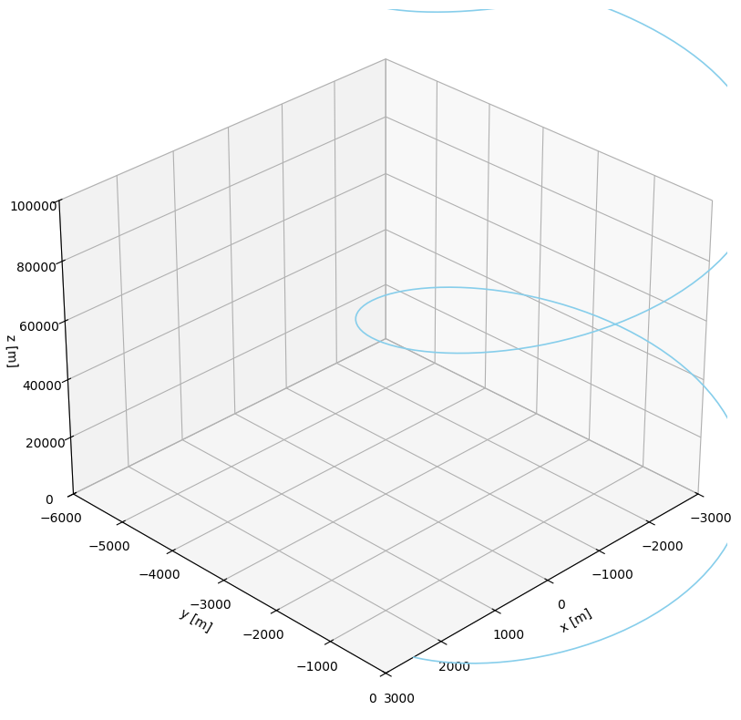

# Problem 1

# Simulating the Effects of the Lorentz Force

## Motivation
The Lorentz force governs the motion of charged particles in electric and magnetic fields and is given by:

$$
\mathbf{F} = q\mathbf{E} + q\mathbf{v} \times \mathbf{B}
$$

This fundamental law plays a key role in many scientific and engineering systems such as:
- **Particle Accelerators**: Controlling charged particle beams.
- **Mass Spectrometers**: Differentiating ions by their mass-to-charge ratio.
- **Plasma Confinement**: Magnetic fields confine plasma in fusion devices like tokamaks.
- **Astrophysics**: Governing charged particle motion in space plasmas.

---

## 1. Exploration of Applications

### Systems Where Lorentz Force is Key:
- **Cyclotrons & Synchrotrons**: Magnetic fields bend particle paths to allow acceleration in circular motion.
- **Mass Spectrometers**: Particles experience force based on $\mathbf{v} \times \mathbf{B}$, revealing mass-to-charge ratios.
- **Plasma Confinement Devices**: Magnetic fields restrict charged particles to follow helical paths.

### Roles of $\mathbf{E}$ and $\mathbf{B}$:
- **Electric Field ($\mathbf{E}$)**: Accelerates or decelerates particles linearly.
- **Magnetic Field ($\mathbf{B}$)**: Alters trajectory through circular or helical motion; does no work but redirects.

---

## 2. Simulating Particle Motion

We'll solve the equations of motion using numerical methods like the **Euler** or **Runge-Kutta 4th order** method.

### Equations of Motion:
Given:
- Charge $q$
- Mass $m$
- Position $\mathbf{r}$
- Velocity $\mathbf{v}$
- Fields $\mathbf{E}$ and $\mathbf{B}$

Acceleration:
$$
\mathbf{a} = \frac{q}{m}(\mathbf{E} + \mathbf{v} \times \mathbf{B})
$$

### Scenarios:
1. **Uniform Magnetic Field Only**: Circular motion (Larmor motion).
2. **Uniform Electric + Magnetic Fields**: Helical motion.
3. **Crossed Fields ($\mathbf{E} \perp \mathbf{B}$)**: Drift motion.

---

## 3. Parameter Exploration

We allow users to modify:
- $E$, $B$ field strengths and directions.
- Initial velocity $\mathbf{v_0}$.
- Particle charge $q$ and mass $m$.

We observe:
- Larmor radius:
$$
R = \frac{mv}{|qB|}
$$
- Cyclotron frequency:
$$
\omega = \frac{|q|B}{m}
$$
- Drift velocity in crossed fields:
$$
\mathbf{v_d} = \frac{\mathbf{E} \times \mathbf{B}}{B^2}
$$

[collab link](https://colab.research.google.com/drive/1r45nz584tcUKeJidLn8081UvAaX9KRKI)
 

# Simulating the Effects of the Lorentz Force

## Motivation
The Lorentz force governs the motion of charged particles in electric and magnetic fields and is given by:

$$
\mathbf{F} = q\mathbf{E} + q\mathbf{v} \times \mathbf{B}
$$

This fundamental law plays a key role in many scientific and engineering systems such as:
- **Particle Accelerators**: Controlling charged particle beams.
- **Mass Spectrometers**: Differentiating ions by their mass-to-charge ratio.
- **Plasma Confinement**: Magnetic fields confine plasma in fusion devices like tokamaks.
- **Astrophysics**: Governing charged particle motion in space plasmas.

# Simulating the Effects of the Lorentz Force

## Motivation
The Lorentz force is defined as:

$$
\mathbf{F} = q\mathbf{E} + q\mathbf{v} \times \mathbf{B}
$$

It determines the motion of charged particles in electric and magnetic fields, essential in systems like particle accelerators, mass spectrometers, and plasma confinement.

---

## 1. Key Applications
- **Cyclotrons**: Circular motion from magnetic fields.
- **Mass Spectrometers**: Ion separation via $\mathbf{v} \times \mathbf{B}$.
- **Tokamaks**: Helical particle confinement.

---

## 2. Simulation Approach
Using numerical integration (Euler or Runge-Kutta), we solve:

$$
\mathbf{a} = \frac{q}{m}(\mathbf{E} + \mathbf{v} \times \mathbf{B})
$$

Scenarios:
- Uniform $\mathbf{B}$: circular motion.
- Uniform $\mathbf{E}$ and $\mathbf{B}$: helical motion.
- Crossed fields: drift motion.

---

## 3. Parameter Effects
- **Larmor Radius**: $R = \frac{mv}{|qB|}$
- **Cyclotron Frequency**: $\omega = \frac{|q|B}{m}$
- **Drift Velocity**: $\mathbf{v_d} = \frac{\mathbf{E} \times \mathbf{B}}{B^2}$

