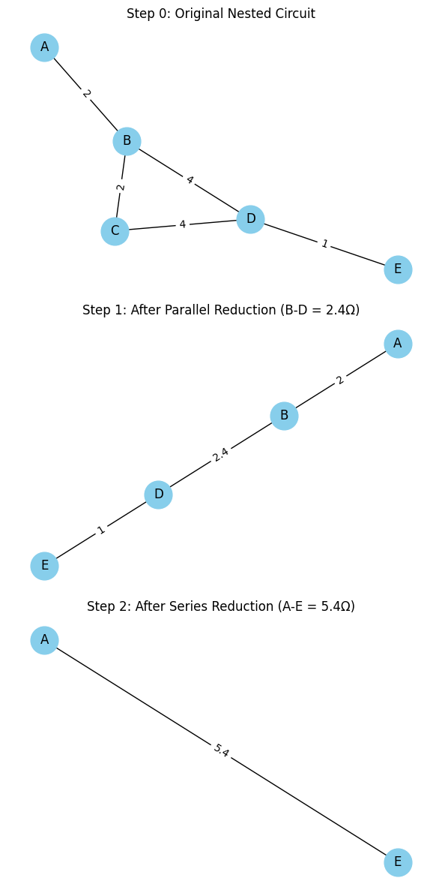
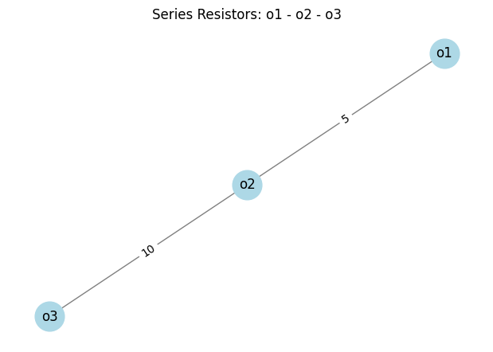
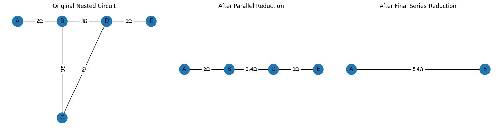

# Problem 1
#  Equivalent Resistance Using Graph Theory with NetworkX

### 1.1 Motivation  
Calculating **equivalent resistance** is fundamental in circuit analysis and design. As electronic systems grow in complexity—with nested loops, bridges, and multiple branches—manual series/parallel simplifications become error-prone and time-consuming. An automated, algorithmic solution is preferable.

### 1.2 Challenges of Manual Simplification  
- **Human Error:** Complex networks easily lead to omission or misapplication of reduction rules.  
- **Scalability:** Traditional methods do not scale well beyond a handful of components.  
- **Lack of Automation:** Each new circuit requires re-derivation, hindering rapid prototyping.

---

## 2. Background Concepts

### 2.1 Graph Theory Fundamentals  
A **graph** $G=(V,E)$ consists of:  
- **Vertices (nodes)** \(V\): Represent circuit junctions  
- **Edges** $E$: Represent resistors, optionally weighted  

**Graph types in NetworkX:**  
- `Graph` — undirected, no parallel edges  
- `MultiGraph` — undirected, supports parallel edges  
- `DiGraph` / `MultiDiGraph` — directed variants  

### 2.2 Electrical Circuit Basics  
- **Series resistors**: share a single junction → $R_\text{eq}=R_1+R_2$  
- **Parallel resistors**: share both end-nodes → $\frac1{R_\text{eq}}=\frac1{R_1}+\frac1{R_2}$  
- **Delta–Y (Star–Delta)**: transforms triangular loops into trees when no simple series/parallel applies  

##  Why Use Graph Theory?

In electrical engineering, calculating **equivalent resistance** is essential for analyzing circuits. Traditionally, we simplify circuits by:
- Combining **resistors in series** (add them)
- Combining **resistors in parallel** (use the reciprocal formula)

However, for **complex circuits**, especially those with mixed configurations or multiple loops, manual simplification becomes inefficient or error-prone.

**Graph theory** provides a structured, programmable approach by modeling circuits as **graphs**.

---

##  Core Idea: Model the Circuit as a Graph

A **circuit** can be seen as a **graph**:
- **Nodes** represent junction points in the circuit
- **Edges** represent resistors between nodes, with resistance as a **weight** or **attribute**

This makes it possible to simplify the circuit algorithmically.

---

##  NetworkX Graph Types

| Graph Type     | Description                              | Use Case                          |
|----------------|------------------------------------------|-----------------------------------|
| `Graph`        | Undirected, no parallel edges            | Simple resistor networks          |
| `DiGraph`      | Directed graph                           | Circuits with diodes or flow      |
| `MultiGraph`   | Allows multiple (parallel) edges         | Circuits with parallel resistors  |
| `MultiDiGraph` | Directed with multiple edges             | Advanced cases with flow + parallel|

For circuits, we often use **`MultiGraph`** to model parallel resistors.

---
[collab](https://colab.research.google.com/drive/1fsUJpDVypQU71mnMMy1hdp6iO0DhJJAF)

#  Visualization of Equivalent Resistance Using Graph Theory

##  Objective

Use **graph theory and NetworkX** to simplify a nested resistor circuit into a single equivalent resistance step-by-step, and **visualize each transformation**.

---

##  Step 0: Original Nested Circuit

The circuit consists of:
- A resistor between `A-B` of 2Ω
- Two paths from `B → D`:
  - Via `C`: `B-C` (2Ω) and `C-D` (4Ω)
  - Direct: `B-D` (4Ω)
- Final segment: `D-E` (1Ω)

# Equivalent Resistance: Graph-Theory Reduction Steps

The figure below illustrates the step-by-step reduction of a nested resistor network into a single equivalent resistor.  

**Figure 1.**  
1. **Original Nested Circuit**  
   - **Nodes:** A, B, C, D, E  
   - **Resistors:**  
     - A–B = 2 Ω  
     - B–C = 2 Ω  
     - C–D = 4 Ω  
     - B–D = 4 Ω  
     - D–E = 1 Ω  

2. **After Parallel Reduction**  
   - Combined the two paths between B and D:  
     - Path 1 (B→C→D): 2 Ω + 4 Ω = 6 Ω  
     - Path 2 (B→D): 4 Ω  
   - Equivalent parallel resistance:  
     $
       R_{BD} = \bigl(\tfrac1{6} + \tfrac1{4}\bigr)^{-1} = 2.4\,\Omega
     $
   - **Remaining resistors:**  
     - A–B = 2 Ω  
     - B–D = 2.4 Ω  
     - D–E = 1 Ω  

3. **After Final Series Reduction**  
   - The series chain A→B→D→E collapses to:  
     $
       R_{\rm eq} = 2 + 2.4 + 1 = 5.4\,\Omega
     $
   - **Final equivalent resistor:** A–E = 5.4 Ω  

---

## Notes

- **Graph-Theory Mapping:**  
  - **Nodes** ↔ circuit junctions  
  - **Edges** ↔ resistors (with a `resistance` attribute)

- **Reduction Rules:**  
  1. **Parallel:** $R_{\rm eq}=\bigl(\sum\tfrac1{R_i}\bigr)^{-1}$  
  2. **Series:** $R_{\rm eq}=\sum R_i$

Use this workflow to automate equivalent-resistance calculations for larger, more complex networks.
