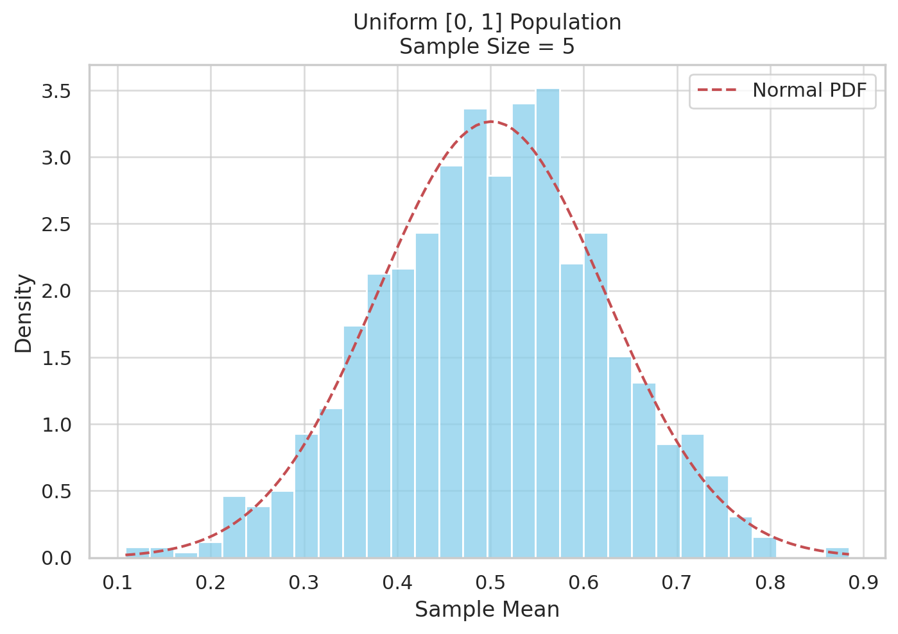
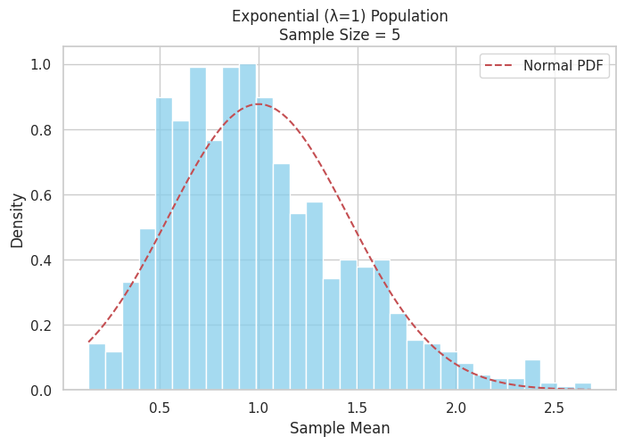

# Problem 1

#  Central Limit Theorem (CLT) Exploration via Simulation

##  Objective

Understand and visualize the **Central Limit Theorem** by simulating sampling distributions from different population types, analyzing how sample size and population variance affect convergence to normality.

---

##  Theoretical Background

### What is the Central Limit Theorem (CLT)?

> The Central Limit Theorem states that for a sufficiently large sample size, the **sampling distribution of the sample mean** becomes approximately **normally distributed**, regardless of the population’s original distribution.

### Key Properties:
- Applies to **independent and identically distributed (i.i.d.)** random variables.
- The mean of the sampling distribution = population mean ($\mu$)
- The standard deviation = $\sigma / \sqrt{n}$, where $n$ is the sample size.

---

##  Simulation Plan

### 1. Population Distributions to Explore

We will simulate populations from:
- **Uniform distribution**: flat, bounded
- **Exponential distribution**: right-skewed
- **Binomial distribution**: discrete

### 2. Sampling Procedure

For each population:
- Generate a population of 100,000 values
- Draw **repeated random samples** (e.g., 1000 times)
- Use **varying sample sizes**: 5, 10, 30, 50
- Compute and store the **sample means**

### 3. Visualization

- Plot **histograms** of the sample means for each distribution and sample size
- Overlay the **normal distribution curve** for comparison

---

#  Visualizing the Central Limit Theorem (CLT)

##  Simulation Setup

We generated large populations from three different distributions:

1. **Uniform [0, 1]**
2. **Exponential (λ = 1)**
3. **Binomial (n = 10, p = 0.5)**

From each population:
- We drew **1000 samples** for each of the following sample sizes: **5, 10, 30, 50**
- For each sample, we computed the **sample mean**
- We then plotted the **distribution of these sample means**

---

##  Interpretation of Results

-  **Uniform Distribution**:  
  Even though the original distribution is flat, the sampling distribution of the mean becomes bell-shaped quickly (by sample size 30).

-  **Exponential Distribution**:  
  Originally highly skewed, yet the sample means converge toward normality as sample size increases.

-  **Binomial Distribution (Discrete)**:  
  Despite being made of whole numbers, the sample mean distribution becomes smooth and normal-like at larger sample sizes.

---

##  CLT in Action

This experiment demonstrates:

| Sample Size | Shape of Sampling Distribution |
|-------------|---------------------------------|
| 5           | Often skewed or irregular       |
| 10          | Begins to smooth out            |
| 30          | Approaching normal shape        |
| 50          | Closely approximates normal     |

---
[colab](https://colab.research.google.com/drive/13RQIym31pOwnJKTRLitfwWuX7ScE7sll)

##  Exponential Distribution (λ = 1) – Sample Size = 5

###  Interpretation:

- This histogram shows the distribution of **1000 sample means**, each calculated from a sample of size **5** drawn from an **exponential population** (λ = 1).
- The **red dashed curve** represents the theoretical **normal distribution** fitted to the observed sample means (using the computed mean and standard deviation).

###  Observations:

- The distribution of sample means is still **right-skewed**, closely resembling the original exponential population.
- **Skewness is preserved** when the sample size is small, which is why the distribution does not yet resemble a normal curve.
- Although the Central Limit Theorem (CLT) guarantees convergence toward normality, this example shows that a **sample size of 5 is not large enough** for the CLT to take full effect for highly skewed populations.

###  Conclusion:

This visualization demonstrates that:
- For **small sample sizes**, the **sampling distribution of the mean** still reflects the original population’s shape.
- The Central Limit Theorem requires **larger sample sizes** to work effectively when the original distribution is skewed, such as exponential distributions.

