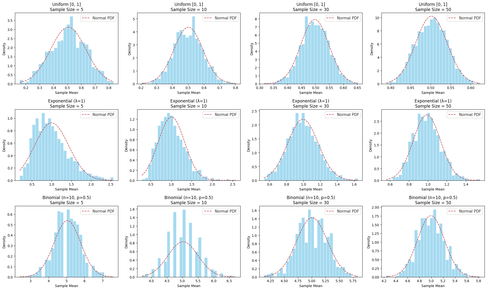

# Problem 1

#  Central Limit Theorem (CLT) Exploration via Simulation

##  Motivation

The **Central Limit Theorem (CLT)** is one of the foundational concepts in statistics. It states that as the sample size increases, the **sampling distribution of the sample mean** tends toward a **normal distribution**, even if the original population distribution is not normal.

This property allows statisticians to make reliable inferences about population parameters using sample data — a principle that underpins many statistical methods used in real-world applications such as manufacturing, medicine, and finance.

By using simulations, we can **observe and understand the CLT** intuitively and practically.

---

##  Problem Statement: Simulating the CLT

We aim to demonstrate the CLT by:

1. Generating large populations from different distributions.
2. Sampling repeatedly from each population using different sample sizes.
3. Visualizing how the **distribution of sample means** changes as the **sample size increases**.

---

##  Simulation Plan

### 1. Population Distributions to Explore

We selected the following distributions, each with distinct characteristics:

- **Uniform [0, 1]** → Continuous, bounded, symmetric
- **Exponential (λ = 1)** → Continuous, right-skewed
- **Binomial (n = 10, p = 0.5)** → Discrete, symmetric

Each population contains **100,000 values** to mimic an effectively infinite population.

### 2. Sampling and Visualization Procedure

For each population:

- Take **1000 random samples** of sizes: **5, 10, 30, 50**
- Calculate the **sample mean** for each sample
- Store these means to form a **sampling distribution**
- Plot the sampling distributions as histograms
- Overlay the theoretical **Normal PDF** based on the calculated mean and standard deviation

---

##  Visualization Output

> Below is a 3×4 grid of histograms showing sampling distributions of the mean for each distribution across increasing sample sizes.

- **Rows**: Population types — Uniform, Exponential, Binomial
- **Columns**: Sample sizes — 5, 10, 30, 50

---

##  Interpretation of Results

###  Uniform Distribution [0, 1]
- **n = 5**: Slightly irregular, but roughly symmetric
- **n = 10**: Becomes smoother
- **n = 30–50**: Very close to normal

###  Exponential Distribution (λ = 1)
- **n = 5**: Strongly skewed
- **n = 10**: Still skewed, but less so
- **n = 30–50**: Clearly approaching a normal bell curve

###  Binomial Distribution (n=10, p=0.5)
- **n = 5**: Already approximately symmetric
- **n = 10–50**: Smooth and almost perfectly normal

---

##  Parameter Exploration

### Sample Size Effect

| Sample Size | Effect on Sampling Distribution               |
|-------------|-----------------------------------------------|
| 5           | Often skewed and irregular                    |
| 10          | Some smoothing appears                        |
| 30          | Typically close to normal                     |
| 50          | Strong approximation of normality             |

### Population Shape & Variance

| Distribution      | Skewed? | Impact on Convergence       | Variance Impact               |
|-------------------|--------|-----------------------------|-------------------------------|
| Uniform           |  No   | Fast convergence            | Lower spread                  |
| Exponential       |  Yes  | Slower convergence          | High variance delays normality|
| Binomial (p=0.5)  |  No   | Quick convergence           | Centered around expected value|

---

[colab](https://colab.research.google.com/drive/13RQIym31pOwnJKTRLitfwWuX7ScE7sll)

#  Exploring the Central Limit Theorem (CLT) via Simulation

##  Summary of Visualization

The figure below illustrates the **Central Limit Theorem** (CLT) using three different population distributions and four different sample sizes. Each subplot shows the **distribution of sample means** computed from 1000 repeated random samples.

---

##  What is the Central Limit Theorem?

> The CLT states that the **sampling distribution of the sample mean** will approach a **normal distribution** as the sample size increases — **regardless of the population's original distribution**, provided that the samples are i.i.d. and the population has finite variance.

---

## 🧩 Structure of the Plot

| Row | Population Type             | Nature              |
|------|-----------------------------|----------------------|
| 1    | Uniform [0, 1]              | Continuous, flat     |
| 2    | Exponential (λ = 1)         | Continuous, skewed   |
| 3    | Binomial (n=10, p=0.5)      | Discrete, symmetric  |

| Column | Sample Size |
|--------|-------------|
| 1      | 5           |
| 2      | 10          |
| 3      | 30          |
| 4      | 50          |

Each histogram shows:
- Blue bars = **Distribution of sample means**
- Red dashed curve = **Normal PDF** fitted to those means

---

# Normal PDF (for overlay)
x = np.linspace(min(sample_means), max(sample_means), 100)
pdf = norm.pdf(x, loc=mu, scale=sigma)

##  Exponential Distribution (λ = 1) – Sample Size = 5

###  Interpretation:

- This histogram shows the distribution of **1000 sample means**, each calculated from a sample of size **5** drawn from an **exponential population** (λ = 1).
- The **red dashed curve** represents the theoretical **normal distribution** fitted to the observed sample means (using the computed mean and standard deviation).

###  Observations:

- The distribution of sample means is still **right-skewed**, closely resembling the original exponential population.
- **Skewness is preserved** when the sample size is small, which is why the distribution does not yet resemble a normal curve.
- Although the Central Limit Theorem (CLT) guarantees convergence toward normality, this example shows that a **sample size of 5 is not large enough** for the CLT to take full effect for highly skewed populations.

###  Conclusion:

This visualization demonstrates that:
- For **small sample sizes**, the **sampling distribution of the mean** still reflects the original population’s shape.
- The Central Limit Theorem requires **larger sample sizes** to work effectively when the original distribution is skewed, such as exponential distributions.

