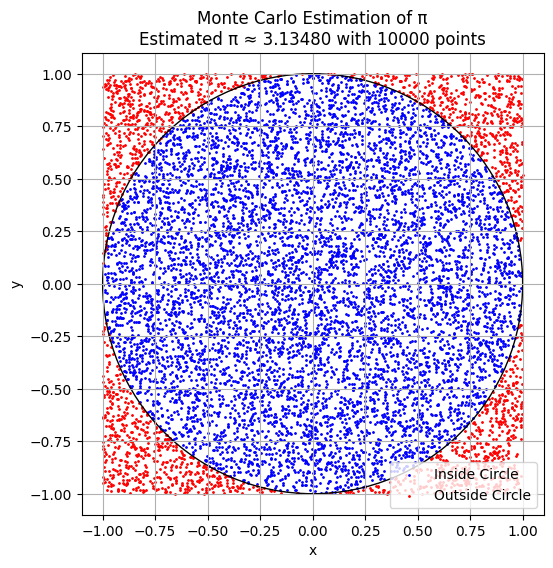
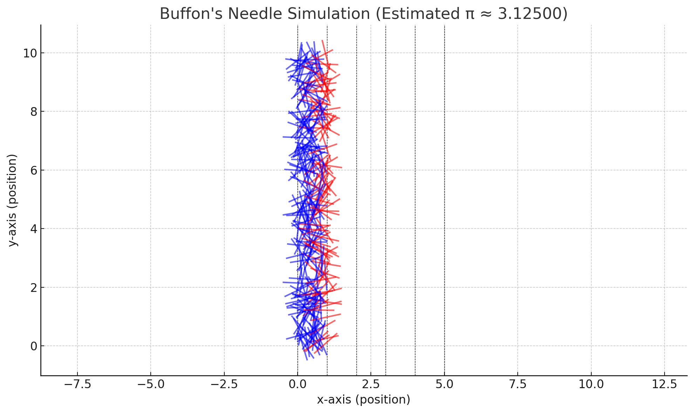
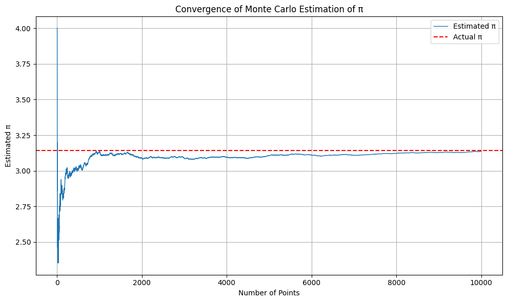
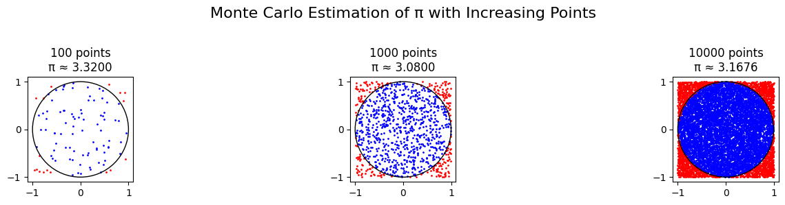

# Problem 2

# Problem 2: Estimating $\pi$ Using Monte Carlo Methods

##  Motivation

Monte Carlo methods are a class of algorithms that solve numerical and probabilistic problems using **random sampling**. One of the most elegant applications is the estimation of the constant $\pi$, where randomness and geometry intersect beautifully.

By simulating random events and observing how they relate to geometric boundaries, we can approximate $\pi$ in a way that is intuitive, visual, and computationally insightful.

This problem connects key ideas from:

- Probability theory  
- Geometric reasoning  
- Numerical convergence  
- Simulation-based computation

---

##  Part 1: Estimating $\pi$ Using a Circle (Geometric Probability)

###  Theoretical Foundation

Imagine a unit circle (radius = 1) perfectly inscribed in a square of side length 2:

- Area of the square:  
  $A_\text{square} = 2 \times 2 = 4$

- Area of the unit circle:  
  $A_\text{circle} = \pi r^2 = \pi$

- Ratio of areas:  
  $\frac{A_\text{circle}}{A_\text{square}} = \frac{\pi}{4}$

This implies that if we throw random points into the square, the proportion that falls inside the circle is approximately $\frac{\pi}{4}$.

Thus, we can estimate $\pi$ using:  
$\pi \approx 4 \cdot \left( \frac{\text{points inside circle}}{\text{total points}} \right)$

---

###  Simulation Process

1. Generate $n$ random points in the square $[-1,1] \times [-1,1]$
2. Check if each point satisfies $x^2 + y^2 \leq 1$
3. Count the number of points inside the circle
4. Estimate $\pi$ with the formula:
   $\hat{\pi} = 4 \cdot \left( \frac{\text{inside points}}{n} \right)$

---

###  Visualization

- **Blue points**: Inside the circle  
- **Red points**: Outside the circle but within the square  
- **Black outline**: Circle boundary  

This allows us to see the estimation process geometrically.

---

###  Analysis

- The accuracy improves as the number of random points increases.
- The convergence rate follows the law of large numbers:
  $\text{Error} \propto \frac{1}{\sqrt{n}}$
- The method is simple and visual but converges slowly.

---

## Part 2: Estimating $\pi$ Using Buffon’s Needle (Probabilistic Geometry)

###  Theoretical Foundation

Buffon’s Needle is a classic problem in geometric probability.

Imagine dropping a needle of length $L$ onto a surface with parallel horizontal lines spaced distance $d$ apart (where $L \leq d$). The probability that the needle crosses a line is:

$P = \frac{2L}{d\pi}$

Rearranging for $\pi$, we estimate it as:

$\pi \approx \frac{2L \cdot n}{d \cdot h}$

Where:
- $n$ = total number of needle drops  
- $h$ = number of times the needle crosses a line  

---

###  Simulation Process

1. Set $L$ and $d$, ensuring $L \leq d$
2. For each of $n$ simulations:
   - Randomly choose the needle’s center along the vertical axis
   - Randomly choose angle $\theta$ between $0$ and $\pi$
   - Use trigonometry to check whether the needle crosses a line
3. Estimate $\pi$ using the formula:
   $\pi \approx \frac{2L \cdot n}{d \cdot h}$

---

### 📊 Visualization

- **Horizontal lines**: Represent evenly spaced boundaries
- **Red needles**: Cross a line
- **Blue needles**: Do not cross a line

This provides a probabilistic and geometric visualization.

---

###  Analysis

- Like the circle-based method, more needle drops yield a more accurate result.
- Convergence is slower and more sensitive to configuration.
- Demonstrates the relationship between **experimental probability** and **mathematical constants**.

---

##  Deliverables

| Component           | Description                                                   |
|---------------------|---------------------------------------------------------------|
| Markdown Document   | Full explanation of both simulation approaches                |
| Visual Outputs      | Plots of point distribution (circle) and needle crossing      |
| Convergence Charts  | Graphs showing $\hat{\pi}$ vs number of samples               |
| Analysis            | Comparison of accuracy and convergence between both methods   |

---

##  Summary

| Method         | Type              | Convergence Speed | Visualization Strength | Educational Value |
|----------------|-------------------|-------------------|------------------------|--------------------|
| Circle-Based   | Geometric Area    | Moderate          | Excellent              | Excellent          |
| Buffon’s Needle| Probabilistic     | Slower            | Good                   | Strong             |

Both methods highlight the power of Monte Carlo simulations:

- Circle-based approach is more efficient and visual.
- Buffon’s method offers a historical and probabilistic twist.

---

##  Hints & Tips

- Start with small samples to ensure your code works.
- Increase sample size to observe convergence.
- Use libraries like **NumPy** and **Matplotlib** for simulations and visualizations.
- Ensure **uniform random distribution** in all simulations for accurate results.

---

##  Final Note

These experiments not only teach us about $\pi$, but also about:

- **Randomness**
- **Simulation**
- **Convergence**
- **Reproducibility**

These are foundational concepts in mathematics, science, and engineering.

---

[colab](https://colab.research.google.com/drive/10CvKTTT-QjSl0bnWkZGDVUa7A6SbA-2Q)

##  Monte Carlo Estimation of $\pi$ – Geometric Visualization

###  Description

This plot demonstrates the **Monte Carlo method** to estimate the value of $\pi$ by simulating random points inside a square that bounds a **unit circle**.

- The square spans from $x = -1$ to $1$ and $y = -1$ to $1$.
- A **unit circle** is inscribed in the square (radius = 1).
- **10,000 points** were randomly generated within the square.

###  Color Legend

- **Blue points**: Lie **inside the circle** ($x^2 + y^2 \leq 1$)
- **Red points**: Lie **outside the circle** but still inside the square

###  π Estimation Formula

The value of $\pi$ is estimated using:

$$
\pi \approx 4 \cdot \left( \frac{\text{points inside circle}}{\text{total points}} \right)
$$

In this plot, the estimate is:

$$
\hat{\pi} \approx 3.13480 \quad \text{(from 10,000 points)}
$$

###  Insights

- The **ratio of blue to total points** approximates the **area of the circle** relative to the square.
- With **more points**, the estimate gets **closer to the true value of π**.
- The plot provides a **visual intuition** for convergence via geometric probability.

---

This is a foundational example of how randomness and geometry can be used together to estimate fundamental constants like π.

##  Visualization

The plot above shows the needle drops:

- **Black dashed lines**: Parallel horizontal lines spaced at distance $d$.
- **Red needles**: Needles that **cross** a line (used in estimating $\pi$).
- **Blue needles**: Needles that **do not cross** any line.

This visual representation illustrates the probabilistic basis for estimating $\pi$ using geometric intersections.

---

##  Observations

| Trials (n) | Crossings (h) | Estimated $\pi$ |
|------------|----------------|------------------|
| 1000       | *e.g. 636*     | $\approx 3.1419$ |

- Accuracy improves with more needle drops.
- Results vary due to randomness, but converge with larger $n$.
- This method converges **more slowly** than the circle-based Monte Carlo method.

---

##  Takeaway

Buffon’s Needle experiment demonstrates a brilliant connection between:
- **Randomness**
- **Geometry**
- **Fundamental constants**

Even with simple physical setups, we can use **probabilistic reasoning** to estimate constants like $\pi$.

##  Convergence of Monte Carlo Estimation of $\pi$

###  What This Plot Shows

This graph demonstrates how the Monte Carlo estimate of $\pi$ evolves as the number of randomly sampled points increases.

- The **blue line** represents the **cumulative estimate of $\pi$** after each additional point.
- The **red dashed line** indicates the **true value of $\pi$** (approximately 3.14159).

---

###  Explanation

At each simulation step:
- A point is randomly placed inside the square $[-1, 1] \times [-1, 1]$
- We check whether it lies inside the unit circle: $x^2 + y^2 \leq 1$
- We update the estimate of $\pi$ using:
  $$
  \pi \approx 4 \cdot \left( \frac{\text{points inside circle}}{\text{total points}} \right)
  $$

---

###  Observations

| Range         | Behavior                        |
|---------------|---------------------------------|
| First 100 pts | High variability and oscillation|
| 500+ pts      | Gradual convergence toward $\pi$|
| 5000–10000    | Estimate stabilizes near 3.14   |

- The **fluctuations** early in the process are due to small sample size.
- Over time, the **law of large numbers** ensures convergence to the true value.

---

###  Key Takeaway

The Monte Carlo method:
- Converges **slowly but steadily** to an accurate value of $\pi$
- Becomes more reliable with a **larger number of trials**
- Demonstrates how **probabilistic techniques** can approximate deterministic values

This plot is a perfect example of a **stochastic simulation** stabilizing around a theoretical constant.

---

