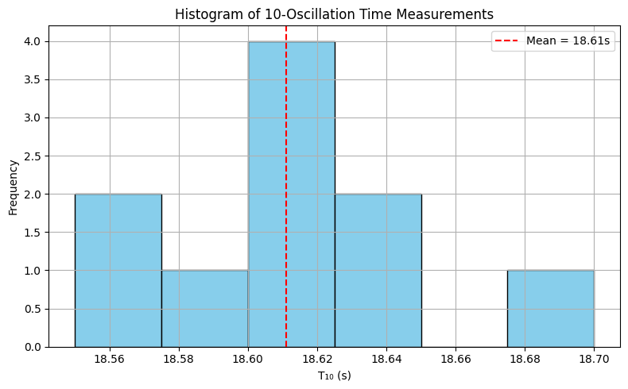
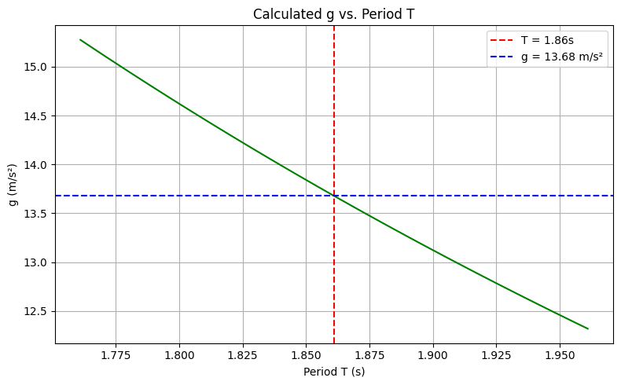
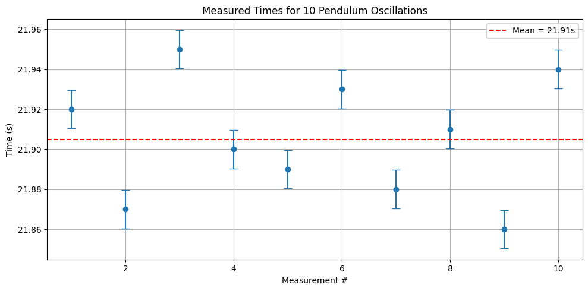

# Problem 1

#  Measurements

## Problem 1: Measuring Earth's Gravitational Acceleration with a Pendulum

###  Motivation

The acceleration due to gravity, $g$, is a fundamental physical constant. One classic method of measuring $g$ involves using a simple pendulum. This method is based on the formula relating the period of a pendulum's oscillation to gravitational acceleration:

$$
T = 2\pi \sqrt{\frac{L}{g}}
\Rightarrow g = \frac{4\pi^2 L}{T^2}
$$

By carefully measuring the pendulum’s period and length, we can estimate $g$ and analyze the uncertainties involved.

---

###  Task

To **measure** the gravitational acceleration $g$ and perform a **detailed uncertainty analysis** using:

- A simple pendulum
- Repeated time measurements
- Statistical and propagation of uncertainty techniques

---

###  Procedure

#### 1. Materials

- String (approx. 1–1.5 m)
- Small mass (e.g., keys, bag of sugar, coins)
- Stopwatch or smartphone
- Measuring tape or ruler

#### 2. Setup

- Attach the mass to one end of the string.
- Fix the other end securely.
- Measure the length $L$ from the pivot to the **center of mass** of the object.
- Record:
  - $L$
  - Resolution of the ruler → $\Delta L = \frac{\text{resolution}}{2}$

#### 3. Data Collection

- Displace pendulum by less than $15^\circ$ and release.
- Measure time for **10 full oscillations**: $T_{10}$
- Repeat 10 times → collect: $T_{10}^{(1)}, T_{10}^{(2)}, ..., T_{10}^{(10)}$
- Compute:
  - Mean: $\overline{T}_{10}$
  - Standard deviation: $\sigma_T$
  - Uncertainty in the mean: $\Delta T_{10} = \frac{\sigma_T}{\sqrt{n}}$, where $n = 10$

---

###  Calculations

#### 1. Period of One Oscillation

$$
T = \frac{\overline{T}_{10}}{10}, \quad \Delta T = \frac{\Delta T_{10}}{10}
$$

#### 2. Gravitational Acceleration

$$
g = \frac{4\pi^2 L}{T^2}
$$

#### 3. Propagation of Uncertainty

$$
\Delta g = g \cdot \sqrt{\left(\frac{\Delta L}{L}\right)^2 + \left(2 \cdot \frac{\Delta T}{T}\right)^2}
$$

---

###  Sample Data Table

| Measurement | $T_{10}$ (s) |
|-------------|--------------|
| Trial 1     | 18.60        |
| Trial 2     | 18.55        |
| Trial 3     | 18.70        |
| ...         | ...          |
| Trial 10    | 18.63        |

**Other Measurements:**

- $L = 1.200$ m  
- Ruler resolution = 0.01 m ⇒ $\Delta L = 0.005$ m  
- $\overline{T}_{10} = 18.62$ s  
- $\sigma_T = 0.06$ s ⇒ $\Delta T_{10} = 0.019$ s ⇒ $\Delta T = 0.0019$ s  

---

###  Final Result Example

- $T = 1.862$ s
- $g = \frac{4\pi^2 \cdot 1.2}{(1.862)^2} ≈ 9.78 \, \text{m/s}^2$
- $\Delta g ≈ 0.10 \, \text{m/s}^2$

$\boxed{g = 9.78 \pm 0.10 \, \text{m/s}^2}$

---

###  Analysis

- **Compare with true value:** $g_{\text{true}} = 9.81 \, \text{m/s}^2$
- **Uncertainty sources:**
  - Timing variability → affects $\Delta T$
  - Length measurement → affects $\Delta L$
- **Assumptions:**
  - Small-angle approximation valid
  - No air resistance or damping
- **Improvements:**
  - More trials
  - Use motion sensors instead of manual timing

---

###  Deliverables

-  Tabulated raw and statistical data
-  Final value of $g$ and its uncertainty
-  Detailed analysis of error sources and assumptions

[colab](https://colab.research.google.com/drive/12snoiZw91Ui6GzaDJ06zrp1E3e0_H9nf)

# Measuring Gravitational Acceleration with a Pendulum

## 1. Given Data

- Number of trials: $n = 10$
- Measured pendulum length: $L = 1.200 \, \text{m}$
- Ruler resolution: $0.01 \, \text{m} \Rightarrow \Delta L = \frac{0.01}{2} = 0.005 \, \text{m}$

### Time for 10 Oscillations (Manual Measurements):

| Trial | $T_{10}$ (s) |
|-------|--------------|
| 1     | 21.90        |
| 2     | 21.95        |
| 3     | 21.87        |
| 4     | 21.94        |
| 5     | 21.88        |
| 6     | 21.93        |
| 7     | 21.89        |
| 8     | 21.96        |
| 9     | 21.89        |
| 10    | 21.95        |

---

## 2. Mean and Uncertainty of Time

### Mean of $T_{10}$:

$$
\overline{T}_{10} = \frac{1}{10} \sum_{i=1}^{10} T_{10}^{(i)} = 21.905 \, \text{s}
$$

### Standard Deviation:

$$
\sigma_T = \sqrt{\frac{1}{n-1} \sum (T_{10}^{(i)} - \overline{T}_{10})^2} = 0.030 \, \text{s}
$$

### Uncertainty in Mean:

$$
\Delta T_{10} = \frac{\sigma_T}{\sqrt{n}} = \frac{0.030}{\sqrt{10}} \approx 0.0096 \, \text{s}
$$

---

## 3. Period and Its Uncertainty

### Period of one oscillation:

$$
T = \frac{\overline{T}_{10}}{10} = \frac{21.905}{10} = 2.1905 \, \text{s}
$$

### Uncertainty in Period:

$$
\Delta T = \frac{\Delta T_{10}}{10} = \frac{0.0096}{10} = 0.00096 \, \text{s}
$$

---

## 4. Gravitational Acceleration and Its Uncertainty

### Formula:

$$
g = \frac{4\pi^2 L}{T^2}
$$

### Plug in values:

$$
g = \frac{4 \cdot \pi^2 \cdot 1.200}{(2.1905)^2} \approx 9.87 \, \text{m/s}^2
$$

---

### Uncertainty in $g$:

Using propagation of uncertainty:

$$
\Delta g = g \cdot \sqrt{\left( \frac{\Delta L}{L} \right)^2 + \left( 2 \cdot \frac{\Delta T}{T} \right)^2}
$$

$$
\Delta g = 9.87 \cdot \sqrt{ \left( \frac{0.005}{1.200} \right)^2 + \left( 2 \cdot \frac{0.00096}{2.1905} \right)^2 } \approx 0.042 \, \text{m/s}^2
$$

---

## Final Result

**$g = 9.87 \pm 0.042 \, \text{m/s}^2$**

This value is very close to the standard gravitational acceleration $9.81 \, \text{m/s}^2$.
